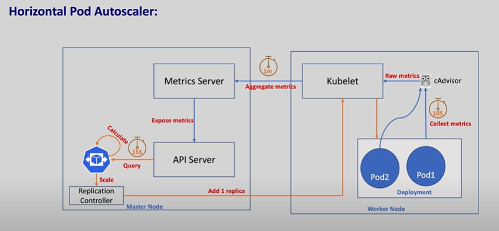

# Notes on Kubernetes

## Index

- [What is Kubernetes?](#what-is-kubernetes)
- [Kubernetes Service vs Deployment - What's the difference between a Service and a Deployment in Kubernetes?](#kubernetes-service-vs-deployment---whats-the-difference-between-a-service-and-a-deployment-in-kubernetes)
- [What does ClusterIP, NodePort, and LoadBalancer mean?](#what-does-clusterip-nodeport-and-loadbalancer-mean)
- [Daemonsets in Kubernetes](#daemonsets-in-kubernetes)
- [Keys and certificates](#keys-and-certificates)
- [RBAC Authorization](#rbac-authorization)
- [Autoscaling in Kubernetes](#autoscaling-in-kubernetes)
- [StorageClass, Persistent Volume, and Persistent Volume Claim in Kubernetes](#storageclass-persistent-volume-and-persistent-volume-claim-in-kubernetes)
- [What are StatefulSets in Kubernetes?](#what-are-statefulsets-in-kubernetes)
- [What are headless services in Kubernetes?](#what-are-headless-services-in-kubernetes)
- [Configuring Health Checks in Pods](#configuring-health-checks-in-pods)
- [Add and Manage Node in Kubernetes Cluster](#add-and-manage-node-in-kubernetes-cluster)
- [Useful Aliases & JSON Path Queries for Kubernetes](#useful-aliases--json-path-queries-for-kubernetes)
- [What is File Descriptor?](#what-is-file-descriptor)
- [Changing CIDR of the cluster via `podCIDR` of each node](#changing-cidr-of-the-cluster-via-podcidr-of-each-node)
- [Dynamic provisioning of volumes in Kubernetes](#dynamic-provisioning-of-volumes-in-kubernetes-with-a-demo)
- [Install Metrics Server in cluster](#install-metrics-server-in-cluster)
- [Join new Kubernetes Worker Node to an existing Cluster](#join-new-kubernetes-worker-node-to-an-existing-cluster)
- [What are finalizers?](#what-are-finalizers)
- [CRI, CNI, CSI in Kubernetes](#cri-cni-csi-in-kubernetes)
- [Kubernetes Networking Bottlenecks](#kubernetes-networking-bottlenecks)

## What is Kubernetes?

▪️ Kubernetes is an open-source container orchestration platform designed to automate deploying, scaling and managing containerized applications.

▪️ It provides a framework to run distributed systems resiliently.

▪️ Kubernetes uses a declarative approach to configuration.

▪️ Users define the desired state of their applications and infrastructure, and Kubernetes continuously works to maintain that state.

=> This is a key principle that underpins much of Kubernetes' functionality.

### Components of Kubernetes -

- `[ Pods ]` - Basic scheduling unit that holds one or more containers.

- `[ Nodes ]` - Machines (physical or virtual) in the cluster where pods are scheduled.

- `[ Cluster ]` - Collection of nodes and associated resources.

- `[ Kubelet ]` - An agent running on each node, responsible for managing the node and its containers.

- `[ Kubernetes Controller Manager ]` Manages controllers to regulate the state of the system.

- `[ Kube Proxy ]` - Maintains network rules to allow communication between pods and external traffic. (kind of Midiater firewall)

- `[ etcd ]` - Consistent and highly-available key-value store used for all cluster data.

- `[ API Server ]` - Serves the Kubernetes API and is the primary entry point for administrative tasks.

- `[ Scheduler ]` - Assigns pods to nodes based on resource requirements and other constraints.

- `[ Controller ]` - Maintains the desired state of the system, such as ensuring the correct number of replicas for a particular application.

- `[ Service ]` - Provides a consistent way to access a set of pods.

- `[ Namespace ]` - A way to divide cluster resources between multiple users.

- `[ Volumes ]` - Kubernetes supports various types of storage volumes, providing data persistence for pods.

- `[ Secrets and ConfigMaps ]` - Mechanisms to manage sensitive information and configuration data separately from application code.

- `[ Deployment ]` - A higher-level resource that manages updates to applications by handling the deployment and scaling of pods.

- `[ StatefulSets ]` - Manages stateful applications, ensuring stable network identities and persistent storage for pods.

- `[ DaemonSets ]` - Ensures that specific pods run on all (or specific) nodes for cluster-wide tasks like logging or monitoring.

- `[ Jobs and CronJobs ]` - Run short-lived or scheduled tasks within the cluster.

- `[ Ingress ]` - Manages external access to services, typically HTTP.

- `[ Network Policies ]` - Define how groups of pods can communicate with each other and other network endpoints.

- `[ Horizontal Pod Autoscaler ]` Automatically adjusts the number of replica pods to handle varying load.

- `[ Vertical Pod Autoscaler ]` - Adjusts the resources allocated to individual pods based on their usage.

- `[ Operators ]` - A way to package, deploy, and manage applications using Kubernetes APIs and controllers.

- `[ Kubectl ]` - The command-line interface to interact with Kubernetes clusters.

### etcd in Kubernetes

In Kubernetes, etcd is a distributed, consistent key value store that holds the entire state of the cluster. Every component in Kubernetes relies on etcd through the API server to know what should be running and what is actually running.

What etcd Stores:

- Pod specifications, Deployments, Services, ConfigMaps, Secrets, and other Kubernetes resources.
- Status information such as pod conditions, node health, and workloads running state.
- Policies and cluster wide metadata including RBAC roles, quotas, and namespaces.


When you create a Pod using `kubectl`, the API server validates the request and writes the Pod specification into `etcd`. The `scheduler` then assigns a node and updates `etcd` with this decision.

The `kubelet` on the chosen node reads the assigned Pod and reports its status back through the `API server`, which again updates `etcd`.

This loop of **desired** state and **observed** state is always reconciled against the data in `etcd`.

> Every change in the cluster is written to etcd through the API server. Controllers and kubelets do not talk to each other directly. They interact only with the API server.

#### High Availability and etcd

In production, etcd is run as a cluster to ensure fault tolerance. There are two common setups:

**Stacked etcd cluster** - etcd instances run on the same nodes as the Kubernetes control plane components. This setup is simple but offers less resilience in the event of node failures.

This is generally suitable for smaller environments or development clusters where ease of setup and management is prioritized over high availability.

**External etcd cluster** - etcd runs on dedicated nodes separate from the control plane, offering enhanced resilience and fault tolerance.

This setup enhances resilience and fault tolerance, as failures in the control plane do not directly impact etcd, and vice versa.

It provides a higher level of availability, making it the preferred choice for production environments where maintaining cluster stability is crucial.

#### Why etcd is Critical?

If etcd is lost, the cluster loses its memory. Control plane components cannot function without it. This is why backups of etcd are essential for disaster recovery.

Kubernetes provides tools like `etcdctl` snapshot save to back up and restore etcd data.

### Ports in Kubernetes

1. **etcd**:
   - Port 2379/TCP: Used by kube-apiserver to connect to etcd.
   - Port 2380/TCP: Used for peer communication between multiple etcd instances.
   - Port 2381/TCP: Used for etcd metrics (listens on localhost).

2. **kube-apiserver**:
   - Port 6443/TCP: The main port for kube-apiserver, which allows access to various API endpoints.

3. **kube-controller-manager**:
   - Port 10257/TCP: Serves up configuration and debugging information (listens on localhost).

4. **kube-scheduler**:
   - Port 10259/TCP: Serves up metrics and configuration information (listens on localhost).

5. **kube-proxy**:
   - Port 10249/TCP: Serves up metrics and configuration information (listens on all interfaces).
   - Port 10256/TCP: Serves the `/healthz` endpoint (listens on all interfaces).

6. **kubelet**:
   - Port 10250/TCP: Provides various endpoints used by the API server (listens on all interfaces).

The text emphasizes that the kube-apiserver, etcd, and kubelet are the most critical components to secure, as they expose the most functionality to remote hosts.

## Kubernetes Service vs Deployment - What's the difference between a Service and a Deployment in Kubernetes?

- > A deployment is responsible for keeping a set of pods running.

- > A service is responsible for enabling network access to a set of pods.

We could use a deployment without a service to keep a set of identical pods running in the Kubernetes cluster. The deployment could be scaled up and down and pods could be replicated.

Each pod could be accessed individually via direct network requests (rather than abstracting them behind a service), but keeping track of this for a lot of pods is difficult.

We could also use a service without a deployment. We'd need to create each pod individually (rather than "all-at-once" like a deployment). Then our service could route network requests to those pods via selecting them based on their labels.

`Services and Deployments are different, but they work together nicely.`

## What does ClusterIP, NodePort, and LoadBalancer mean?

The type property in the Service's `spec` determines how the service is exposed to the network.

It changes where a Service is able to be accessed from.

The possible types are ClusterIP, NodePort, and LoadBalancer:

- `ClusterIP` – The default value. The service is only accessible from within the Kubernetes cluster – you can’t make requests to your Pods from outside the cluster!
- `NodePort` – This makes the service accessible on a static port on each Node in the cluster.
  - This means that the service can handle requests that originate from outside the cluster.

- `LoadBalancer` – The service becomes accessible externally through a cloud provider's load balancer functionality.
  - GCP, AWS, Azure, and OpenStack offer this functionality.
  - The cloud provider will create a load balancer, which then automatically routes requests to your Kubernetes Service.

## Daemonsets in Kubernetes

Kubernetes is a distributed system and there should be some functionality for kubernetes platform administrators to run platform-specific applications on all the nodes. For example, running a logging agent on all the Kubernetes nodes.

Here is where Daemonset comes into the picture.
Daemonset is a native Kubernetes object. As the name suggests, it is designed to run system daemons.

The DaemonSet object is designed **to ensure that a single pod runs on each worker node.** This means you cannot scale daemonset pods in a node. And for some reason, if the daemonset pod gets deleted from the node, the daemonset controller creates it again.


- > If there are 500 worker nodes and you deploy a daemonset, the daemonset controller will run one pod per worker node by default. That is a total of 500 pods. However, using `nodeSelector, nodeAffinity, Taints, and Tolerations,` you can restrict the daemonset to run on specific nodes.

- > For example, in a cluster of 100 worker nodes, one might have 20 worker nodes labeled GPU enabled to run batch workloads. And you should run a pod on those 20 worker nodes. In this case, you can deploy the pod as a Daemonset using a node selector. We will look at it practically later in this guide.

### Usecases

The very basic use case of DaemonSet is in the cluster itself. If you look at the Kubernetes architecture, the kube-proxy component runs a daemonset.

1. Cluster Log Collection: Running a log collector on every node to centralize Kubernetes logging data. Eg:   fluentd , logstash, fluentbit

2. Cluster Monitoring: Deploy monitoring agents, such as Prometheus Node Exporter, on every node in the cluster to collect and expose node-level metrics. This way prometheus gets all the required worker node metrics.

3. Security and Compliance: Running CIS Benchmarks on every node using tools like kube-bench. Also deploy security agents, such as intrusion detection systems or vulnerability scanners, on specific nodes that require additional security measures. For example, nodes that handle PCI, and PII-compliant data.

4. Storage Provisioning: Running a storage plugin on every node to provide a shared storage system to the entire cluster.

5. Network Management: Running a network plugin or firewall on every node to ensure consistent network policy enforcement. For example, the Calico CNI plugin runs as Daemonset on all the nodes.

- According to requirements, we can deploy multiple DaemonSet for one kind of daemon, using a variety of flags or memory and CPU requests for various hardware types

```yaml
apiVersion: v1
kind: DaemonSet

metadata:
  name: daemon-pod
  namespace: logging
  labels:
    app: pod-logging

spec:
  selector:
    matchLabels:
      name: fluentd

  template:
    metadata:
      labels:
        name: fluentd

    spec:
      containers:
        - name: fluentd-elasticsearch
          image: quay.io/fluentd_elasticsearch/fluentd:v2.5.2

          resources:
            limits:
              memory: 200Mi
            requests:
              cpu: 100m
              memory: 200Mi

          volumeMounts:
          - name: varlog
            mountPath: /var/log

        terminationGracePeriodSeconds: 30
        volumes:
        - name: varlog
          hostPath:
            path: /var/log
```

## Keys and certificates

- Keys and certificates are used in Kubernetes (and other systems) for **authentication**, **encryption**, and **authorization**.

### **Keys**

- **Private Key (`harsh.key`)**:

  - A private key is a secret key used to prove the identity of a user or system.
  - It is used to sign data (e.g., certificate signing requests) and establish secure communication.
  - It must be kept confidential and never shared.

### **Certificates**

- **Certificate (`harsh.crt`)**:
  - A certificate is a public document that binds a public key to an identity (e.g., a user or system).
  - It is issued by a trusted Certificate Authority (CA) and is used to verify the identity of the key owner.
  - In Kubernetes, certificates are used to authenticate users, nodes, or components.

### **Purpose in Kubernetes**

1. **Authentication**:
   - Certificates are used to authenticate users or components (e.g., kubelets, API servers) in the cluster.
   - The `CN` (Common Name) in the certificate identifies the user, and the `O` (Organization) specifies the group.

2. **Encryption**:
   - Certificates enable secure communication between Kubernetes components (e.g., kube-apiserver and kubelet) using TLS (Transport Layer Security).

3. **Authorization**:
   - Certificates can be tied to RBAC (Role-Based Access Control) policies to define what actions a user or component is allowed to perform in the cluster.

## RBAC Authorization

- `Role-based access control (RBAC)` is a method of regulating access to computer or network resources based on the roles of individual users within your organization.

- RBAC authorization uses the `rbac.authorization.k8s.io` API group to drive authorization decisions, allowing you to dynamically configure policies through the Kubernetes API.

- The RBAC API declares four kinds of Kubernetes object: `Role`, `ClusterRole`, `RoleBinding` and `ClusterRoleBinding`.

- > An `RBAC Role` or `ClusterRole` contains rules that represent a set of permissions. Permissions are purely additive (there are no "deny" rules).

- > A Role always sets permissions within a particular namespace; *when you create a Role, you have to specify the namespace it belongs in.*

- > ClusterRole, by contrast, is `a non-namespaced resource`. The resources have different names (Role and ClusterRole) because a Kubernetes object always has to be either namespaced or not namespaced; it can't be both.

- ClusterRoles have several uses. You can use a ClusterRole to:

  1. define permissions on namespaced resources and be granted access within individual namespace(s)
  2. define permissions on namespaced resources and be granted access across all namespaces
  3. define permissions on cluster-scoped resources

If you want to define a role within a namespace, use a Role; if you want to define a role cluster-wide, use a ClusterRole.

- ClusterRole - A ClusterRole can be used to grant the same permissions as a Role. Because ClusterRoles are `cluster-scoped`, you can also use them to grant access to:

  - cluster-scoped resources (like nodes)

  - non-resource endpoints (like /healthz)

  - namespaced resources (like Pods), across all namespaces


- For example: you can use a ClusterRole to allow a particular user to run `kubectl get pods --all-namespaces`

- To grant read access to secrets in any particular namespace, or across all namespaces (depending on how it is bound):

```yaml
# access/simple-clusterrole.yaml
apiVersion: rbac.authorization.k8s.io/v1
kind: ClusterRole
metadata:
  name: secret-reader
rules:
- apiGroups: [""]
  resources: ["secrets"]
  verbs: ["get", "watch", "list"]
```

### Steps to implement RBAC

1. Generate SSL certificate and private key (2048 bit long).

    ```bash
    openssl genrsa -out harsh.key 2048
    ```

2. Create certificate signing request for the user with above key.

    - The private key (`harsh.key`) and certificate signing request (`harsh.csr`) are generated for the user `harsh`.

    ```bash
      openssl req -new \
              -key harsh.key \
              -out harsh.csr \
              -subj "/CN=harsh/O=dev/O=example.org"
    ```

    - The `CN=harsh` specifies the username, and `O=dev` and `O=example.org` specify the groups, which can be used for RBAC rules.

3. Authorize the certificate signing request - CSR with minikube.

    ```bash
    sudo openssl x509 -req \
                -CA /etc/kubernetes/pki/ca.crt \
                -CAkey  /etc/kubernetes/pki/ca.key \
                -CAcreateserial \
                -days 730 \
                -in harsh.csr \
                -out harsh.crt
    ```

    - **Command breakdown**

    - The certificate (`harsh.crt`) is signed by `Minikube's CA`, allowing `harsh` to authenticate with the Kubernetes cluster.

    > `x509` is a standard format for public key certificates.
    > `-req` indicates that the input is a `CSR - Certificate Signing Request`.
    > `-CA /etc/kubernetes/pki/ca.crt` specifies the CA certificate (ca.crt) to use for signing the certificate. Same for a Certificate key.
    > `CAcreateserial` - Automatically generates a serial number file (ca.srl) for the certificate if it doesn't already exist. This ensures that each certificate signed by the CA has a unique serial number.
    > `-days 730` specifies the validity period of the certificate in days (730 days = 2 years).
    > `-in harsh.csr` specifies the input CSR file (harsh.csr) that contains the public key and identity information for the certificate.
    > `-out harsh.crt` specifies the output file (harsh.crt) where the signed certificate will be saved.

    This command is typically used to create a user or component certificate for Kubernetes authentication. The signed certificate `(harsh.crt)` can then be used with the corresponding private key `(harsh.key)` to securely interact with the Kubernetes API.

4. Add user to the kubernetes cluster.

    ```bash
    kubectl config set-credentials harsh --client-certificate=harsh.crt --client-key=harsh.key
    ```

5. Create a context.

    ```bash
    kubectl config set-context harsh-k8s --cluster=kubernetes --user=harsh --namespace=default
    ```

6. Verify context.

    ```bash
    kubectl config get-contexts
    ```

    - To switch the context:

    ```bash
    kubectl config use-context harsh-k8s
    ```

7. Apply the following .yaml to create a new role.

    - An example Role in the "default" namespace that can be used to grant read access to pods:

    ```yaml
    apiVersion: rbac.authorization.k8s.io/v1
    kind: Role
    metadata:
      namespace: default
      name: pod-reader
    rules:
    - apiGroups: [""] # "" indicates the core API group
      resources: ["pods"]
      verbs: ["get", "watch", "list"]
    ```

    - Verify the created role.

    ```bash
    kubectl get roles
    ```

8. Now we should connect these both so the user can have these permissions (RoleBinding).

    > Role[What Can|Cannot access] + Subject [User|Group|ServiceAccount] = RoleBinding

    - Apply the `role.yml` and `role-binding.yml` files from `rbac` directory.

9. Verify the changes via changing contexts alternatively.

### ClusterRole and ClusterRoleBinding

1. Apply the `cluster-role.yml` and `cluster-role-binding.yml` files from `rbac` directory.

### Service Account

- To create new service account,

```bash
kubectl create sa test-sa
```

- To verify that you have an access of a resource:

```bash
kubectl auth can-i create pods # If current context can create pods.
```

```bash
kubectl auth can-i create pods --as="system:serviceaccount:default:test-sa" # If test-sa service account can create pods inside "default" namespace.
kubectl auth can-i get pods --as="system:serviceaccount:default:test-sa" # If test-sa service account can get pods inside "default" namespace.
```

## Autoscaling in Kubernetes

Autoscaling in Kubernetes is a powerful feature that allows applications to dynamically adjust their resource usage based on demand.

It ensures that workloads can scale up during periods of high traffic and scale down during low usage, optimizing resource utilization and reducing costs.


- Kubernetes provides multiple types of autoscaling mechanisms:

### 1. **Horizontal Pod Autoscaler (HPA)**: Automatically adjusts the number of pod replicas in a deployment or replica set based on CPU, memory, or custom metrics



- A formula to calculate the number of pods: `d = ceil [ a * ( c / t )]`

> where,

- `d` = desired number of replicas

- `a` = actual number of replicas

- `c` = current value of the matric

- `t` = target value

#### An Example of CPU usage

```math
d = ceil[2 * (90 / 70)] = ceil[2 * 1.28] = ceil[2.57] = 3 replicas
```

where,

- 90 is current value of the cpu.
- 70 is a target value(max. limit).
- 2 is an actual number of replicas right now.

#### An Example of Memory usage

```math
d = ceil[2 * (1000 / 500)] = ceil[2 * 2] = 4 replicas
```

where,

- 1000 is current value of the memory.
- 500 is a target value(max. limit).
- 2 is an actual number of replicas right now.

- Get the metrics for the replicas via

```bash
kubectl top pods
```

- Get autoscaling metrics

```bash
kubectl get hpa
```

- [WRK](https://github.com/wg/wrk) - A HTTP benchmarking tool

### 2. **Vertical Pod Autoscaler (VPA)**: Dynamically adjusts the resource requests and limits (CPU and memory) of individual pods to match their actual usage

### 3. **Cluster Autoscaler**: Scales the number of nodes in a cluster up or down based on pending pods and resource requirements

- By utilizing autoscaling, Kubernetes ensures that applications remain highly available, responsive, and cost-efficient, even in fluctuating workloads.

[Reference](https://www.youtube.com/watch?v=jyBDbm1FHiM)

## StorageClass, Persistent Volume, and Persistent Volume Claim in Kubernetes

Kubernetes provides a robust storage abstraction layer to manage storage resources independently from compute resources. Three key concepts form the foundation of this system: **StorageClass**, **Persistent Volume (PV)**, and **Persistent Volume Claim (PVC)**.


---

### **StorageClass**

A **StorageClass** defines a "class" of storage offered by a Kubernetes cluster. It allows administrators to describe different types of storage (such as SSDs, HDDs, or network storage) and their properties, such as performance, latency, or backup policies. Each StorageClass specifies a provisioner (the plugin or driver responsible for creating storage), parameters (like storage type or performance level), and a reclaim policy (what happens to the storage when released).

- **Purpose**: Enables dynamic provisioning of storage resources.
- **Usage**: Developers can request a specific StorageClass in their PVCs, or rely on the default if none is specified.
- **Example**: A cluster may have a "fast-ssd" StorageClass for high-performance needs and a "standard" class for general use.

---

### **Persistent Volume (PV)**

A **Persistent Volume** is a cluster-wide storage resource that has been provisioned by an administrator or dynamically provisioned using a StorageClass. PVs are independent of any particular Pod and exist beyond the lifecycle of individual Pods, making them suitable for stateful applications.

- **Purpose**: Provides durable storage that persists even if Pods are deleted or recreated.
- **Types**: Can be backed by various storage systems (NFS, iSCSI, cloud storage, etc.).
- **Lifecycle**: PVs have their own lifecycle, separate from Pods, and are managed as first-class Kubernetes objects.

---

### **Persistent Volume Claim (PVC)**

A **Persistent Volume Claim** is a request for storage by a user or application. PVCs specify the desired storage size, access modes, and optionally the StorageClass. When a PVC is created, Kubernetes matches it to a suitable PV (either pre-provisioned or dynamically created via a StorageClass).

- **Purpose**: Allows users to request and consume storage resources without knowing the underlying details.
- **Usage**: A Pod references a PVC to use the storage; the PVC is then bound to a matching PV.
- **Dynamic Provisioning**: If a suitable PV does not exist, and a StorageClass is specified, Kubernetes can dynamically provision a new PV to satisfy the claim.

---

### **How They Work Together**

- **Administrators** define StorageClasses to describe available storage types.
- **Developers** create PVCs, optionally specifying a StorageClass.
- **Kubernetes** matches PVCs to available PVs, or dynamically provisions new PVs using the requested StorageClass.
- **Pods** mount PVCs to use persistent storage, ensuring data survives Pod restarts and rescheduling.

---

#### **Summary Table**

| Concept             | Description                                                                 |
|---------------------|-----------------------------------------------------------------------------|
| StorageClass        | Defines storage types and properties for dynamic provisioning                |
| Persistent Volume   | Actual storage resource in the cluster, provisioned statically or dynamically|
| Persistent Volume Claim | User/application request for storage, matched to a PV                      |

---

This abstraction enables Kubernetes to manage storage resources flexibly and efficiently, supporting a wide range of application requirements and storage backends.

- Citations:

- [1] <https://kubernetes.io/docs/concepts/storage/storage-classes/>
- [2] <https://www.kubecost.com/kubernetes-best-practices/kubernetes-storage-class/>
- [3] <https://kubernetes.io/docs/concepts/storage/persistent-volumes/>
- [4] <https://bluexp.netapp.com/blog/cvo-blg-kubernetes-storageclass-concepts-and-common-operations>
- [5] <https://spacelift.io/blog/kubernetes-persistent-volumes>
- [6] <https://bluexp.netapp.com/blog/cvo-blg-kubernetes-persistent-volume-claims-explained>
- [7] <https://www.kubermatic.com/blog/keeping-the-state-of-apps-5-introduction-to-storage-classes/>
- [8] <https://bluexp.netapp.com/blog/kubernetes-persistent-storage-why-where-and-how>
- [9] <https://kubernetes.io/docs/tasks/configure-pod-container/configure-persistent-volume-storage/>
- [10] <https://thekubeguy.com/storage-classes-in-kubernetes-1bb62c6e937e>
- [11] <https://www.groundcover.com/blog/kubernetes-pvc>
- [12] <https://zesty.co/finops-glossary/kubernetes-persistent-volume-claim/>
- [13] <https://www.appvia.io/blog/demystifying-kubernetes-storage-classes>
- [14] <https://www.uffizzi.com/kubernetes-multi-tenancy/kubernetes-storage-class>
- [15] <https://aws.amazon.com/blogs/storage/persistent-storage-for-kubernetes/>
- [16] <https://kubernetes.io/docs/concepts/storage/volumes/>
- [17] <https://cloud.google.com/kubernetes-engine/docs/concepts/persistent-volumes>
- [18] <https://www.apptio.com/topics/kubernetes/best-practices/storage-class/>
- [19] <https://kubernetes.io/docs/tasks/administer-cluster/change-default-storage-class/>
- [20] <https://www.youtube.com/watch?v=BNKb-SOnoKk>
- [21] <https://www.purestorage.com/knowledge/what-is-kubernetes-persistent-volume.html>
- [22] <https://spot.io/resources/kubernetes-architecture/7-stages-in-the-life-of-a-kubernetes-persistent-volume-pv/>
- [23] <https://www.netapp.com/devops/what-is-kubernetes-persistent-volumes/>
- [24] <https://www.loft.sh/blog/kubernetes-persistent-volume>
- [25] <https://ranchermanager.docs.rancher.com/how-to-guides/new-user-guides/manage-clusters/create-kubernetes-persistent-storage/manage-persistent-storage/about-persistent-storage>
- [26] <https://forum.huawei.com/enterprise/intl/en/thread/dynamic-provisioning-with-kubernetes-storage-classes-huawei-evs/694728783145353216?blogId=694728783145353216>

---

Kubernetes does not define a fixed set of "types" of StorageClasses. Instead, a StorageClass is a customizable Kubernetes object that cluster administrators use to describe different storage offerings available in the cluster. The types and features of StorageClasses are determined by the underlying storage provisioners, their parameters, and policies set by the administrator[3].

### Common Types of StorageClasses

**StorageClasses are typically differentiated by:**

- The storage provisioner (e.g., AWS EBS, GCE PD, NFS, Ceph, CSI drivers, etc.)
- Performance characteristics (e.g., SSD vs. HDD, high IOPS, low latency)
- Data redundancy or backup policies
- Availability zones or regions
- Cost and reclaim policies

**Examples of StorageClass types:**

- Fast SSD storage
- Standard HDD storage
- Encrypted storage
- Replicated or multi-zone storage
- Low-latency storage
- Backup-enabled storage

**Each StorageClass includes fields such as:**

- `provisioner`: The driver or plugin that provisions the storage (e.g., `kubernetes.io/aws-ebs`, `kubernetes.io/gce-pd`, or a CSI driver).
- `parameters`: Key-value pairs for storage configuration (e.g., disk type, IOPS, encryption).
- `reclaimPolicy`: What happens to the storage after release (e.g., `Delete` or `Retain`).
- `allowVolumeExpansion`: Whether the volume can be resized.
- `volumeBindingMode`: When and how the volume is bound to a node[3].

**Sample StorageClass YAML:**

```yaml
apiVersion: storage.k8s.io/v1
kind: StorageClass
metadata:
  name: fast-ssd
provisioner: kubernetes.io/aws-ebs
parameters:
  type: gp2
  encrypted: "true"
reclaimPolicy: Delete
allowVolumeExpansion: true
```

#### Default StorageClass

You can mark one StorageClass as the default for the cluster. Any PersistentVolumeClaim (PVC) that does not specify a `storageClassName` will use the default StorageClass[3].

#### Summary Table

| StorageClass Example      | Provisioner                 | Purpose/Type             |
|--------------------------|-----------------------------|--------------------------|
| fast-ssd                 | AWS EBS, GCE PD, CSI driver | High-performance SSD     |
| standard-hdd             | AWS EBS, GCE PD, CSI driver | Cost-effective HDD       |
| encrypted-storage        | Any                         | Encrypted volumes        |
| replicated-multi-zone    | Cloud provider, CSI         | High-availability        |
| low-latency              | Custom CSI driver           | Low-latency workloads    |

**In summary:**
There is no fixed list of StorageClass "types" in Kubernetes; rather, StorageClasses are defined by the cluster administrator to represent the storage capabilities and policies available in the environment. The actual types depend on the storage systems and provisioners integrated with the Kubernetes cluster[3].

Citations:

- [1] <https://byjus.com/gate/storage-classes-in-c/>
- [2] <https://www.upgrad.com/blog/storage-classes-in-c/>
- [3] <https://kubernetes.io/docs/concepts/storage/storage-classes/>
- [4] <https://cloud.google.com/storage/docs/storage-classes>
- [5] <https://aws.amazon.com/s3/storage-classes/>
- [6] <https://www.shiksha.com/online-courses/articles/storage-classes-in-c/>
- [7] <https://www.nielit.gov.in/gorakhpur/sites/default/files/Gorakhpur/OLevel_2_B4_CLang_5May20_SS.pdf>
- [8] <https://www.codecademy.com/resources/docs/c/storage-classes>

---

### How do you set a default StorageClass in a Kubernetes cluster

To set a default StorageClass in a Kubernetes cluster, you need to annotate the desired StorageClass with `storageclass.kubernetes.io/is-default-class: "true"`. Here’s how you can do it:

1. **List existing StorageClasses** to see which one is currently set as default:

    ```bash
    kubectl get storageclass
    ```

    The default StorageClass will be marked with `(default)` in the output.

2. **Mark an existing StorageClass as non-default** (if needed) by removing or setting its annotation to `"false"`:

    ```bash
    kubectl patch storageclass  -p '{"metadata": {"annotations":{"storageclass.kubernetes.io/is-default-class":"false"}}}'
    ```

    Replace `` with the name of the current default StorageClass.

3. **Set your chosen StorageClass as the default** by adding or updating the annotation:

    ```bash
    kubectl patch storageclass  -p '{"metadata": {"annotations":{"storageclass.kubernetes.io/is-default-class":"true"}}}'
    ```

    Replace `` with the name of the StorageClass you want as default.

4. **Verify the change**:

    ```bash
    kubectl get storageclass
    ```

    The new default will be marked with `(default)`.

#### Alternatively, when creating a new StorageClass, you can include this annotation directly in the manifest

```yaml
apiVersion: storage.k8s.io/v1
kind: StorageClass
metadata:
  name: my-storage-class
  annotations:
    storageclass.kubernetes.io/is-default-class: "true"
provisioner:
parameters:
  # ...
```

Then apply it with:

```bash
kubectl apply -f
```

**Note:**

- You can technically have more than one default StorageClass, but Kubernetes will use the most recently created one for PVCs without a specified `storageClassName`. It's best practice to have only one default[2].
- If you remove all default annotations, there will be no default StorageClass, and PVCs without a specified class will not be dynamically provisioned[2].

This process allows you to control which StorageClass is used by default for dynamic provisioning of storage in your cluster.

Citations:

- [1] <https://kubernetes.io/docs/tasks/administer-cluster/change-default-storage-class/>
- [2] <https://kubernetes.io/docs/concepts/storage/storage-classes/>
- [3] <https://cloud.google.com/kubernetes-engine/distributed-cloud/vmware/docs/how-to/default-storage-class>
- [4] <https://bluexp.netapp.com/blog/cvo-blg-kubernetes-storageclass-concepts-and-common-operations>
- [5] <https://www.edureka.co/community/52699/how-do-i-change-the-default-storageclass>
- [6] <https://cloud.google.com/kubernetes-engine/distributed-cloud/bare-metal/docs/installing/default-storage-class>
- [7] <https://docs.openshift.com/container-platform/4.13/storage/container_storage_interface/persistent-storage-csi-sc-manage.html>
- [8] <https://www.kubecost.com/kubernetes-best-practices/kubernetes-storage-class/>

---

### How does the reclaim policy affect PVs when a StorageClass is deleted

The reclaim policy of a Persistent Volume (PV) determines what happens to the underlying storage asset when its associated Persistent Volume Claim (PVC) is deleted-not when the StorageClass itself is deleted. Deleting a StorageClass has **no direct effect** on the reclaim policy or the lifecycle of existing PVs and PVCs.

Here’s how reclaim policy works in this context:

- **Retain:** If a PV's reclaim policy is set to `Retain`, deleting the PVC will release the PV, but the PV and its data will remain. The PV is not automatically deleted or made available for another claim until an administrator manually intervenes.
- **Delete:** If a PV's reclaim policy is `Delete`, deleting the PVC will also delete the PV and the underlying storage asset in the external infrastructure.

**When a StorageClass is deleted:**

- Existing PVs and PVCs that were provisioned using that StorageClass are unaffected and continue to follow their set reclaim policy.
- The reclaim policy of a PV does not change or trigger any action due to the deletion of the StorageClass.
- Only new dynamic provisioning using the deleted StorageClass is prevented.

**Summary:**
Deleting a StorageClass does not impact the reclaim policy or behavior of existing PVs. The reclaim policy continues to govern what happens when PVCs are deleted, regardless of the existence of the StorageClass.

Citations:

- [1] <https://kubernetes.io/docs/concepts/storage/persistent-volumes/>
- [2] <https://kubernetes.io/docs/tasks/administer-cluster/change-pv-reclaim-policy/>
- [3] <https://docs.oracle.com/en-us/iaas/compute-cloud-at-customer/topics/oke/retaining-a-persistent-volume.htm>
- [4] <https://www.kubermatic.com/blog/keeping-the-state-of-apps-4-persistentvolumes-and-persistentvolum/>
- [5] <https://docs.redhat.com/en/documentation/red_hat_build_of_microshift/4.14/html/storage/understanding-persistent-storage-microshift>
- [6] <https://docs.openshift.com/container-platform/4.12/storage/understanding-persistent-storage.html>
- [7] <https://github.com/openebs/zfs-localpv/issues/507>
- [8] <https://github.com/jupyterhub/zero-to-jupyterhub-k8s/issues/901>

---

## What are StatefulSets in Kubernetes?

StatefulSets are designed to manage stateful applications that require persistent storage and ordering guarantees. They ensure that each Pod in the set has a unique identity and maintains its state across rescheduling.


Here's a sample YAML for a StatefulSet that demonstrates the basic components:

```yaml
apiVersion: apps/v1
kind: StatefulSet
metadata:
  name: web
spec:
  replicas: 3
  serviceName: web
  selector:
    matchLabels:
      app: web
  template:
    metadata:
      labels:
        app: web
    spec:
      containers:
      - name: web
        image: nginx:latest
        volumeMounts:
        - name: www
          mountPath: /usr/share/nginx/html
  volumeClaimTemplates:
  - metadata:
      name: www
    spec:
      accessModes: ["ReadWriteOnce"]
      resources:
        requests:
          storage: 1Gi
```

This YAML defines a StatefulSet named `web` with 3 replicas, a service name `web`, and a container image `nginx:latest`. It also defines a volume claim template `www` that requests 1 GiB of storage. Each Pod in the set will have a unique identity and persistent storage.

### So if one of pod restarts, it will retain the previous states?

One of the key features of StatefulSets is that they maintain the state of each Pod across restarts. This is achieved through the use of Persistent Volumes (PVs) and Persistent Volume Claims (PVCs).

When a Pod restarts, the StatefulSet controller will:

1. Check if the Pod has a Persistent Volume Claim (PVC) associated with it.
2. If the PVC exists, the controller will attempt to mount the associated Persistent Volume (PV) to the new Pod.
3. The new Pod will retain the same identity and state as the previous Pod, including any data stored on the Persistent Volume.

This ensures that the Pod retains its state and any data it was processing before it restarted.

However, it's worth noting that the StatefulSet controller will only attempt to restore the state of a Pod if it has a matching Persistent Volume Claim (PVC) associated with it. If the PVC is deleted or not properly configured, the Pod will not retain its state across restarts.

## Configuration Management in Kubernetes

Configuration management is a critical aspect of deploying applications in Kubernetes. This module focuses on two key Kubernetes objects that help manage configuration data:

- `ConfigMaps`: For storing non-sensitive configuration data
- `Secrets`: For storing sensitive information like credentials and certificates

Both objects help to decouple configuration from your application code and container images, making your applications more portable and easier to manage across different environments.

### What are ConfigMaps(cm)?

A ConfigMap is a Kubernetes API object used to store non-sensitive configuration data in key-value pairs. ConfigMaps serve a critical purpose: **they decouple configuration from application code and container images.**

This separation enables you to:

- Keep your container images generic and reusable
- Change configuration without rebuilding images
- Use the same application across different environments (development, testing, production)
- Follow container best practices by maintaining immutable application images


ConfigMaps can store:

- Individual key-value pairs
- Entire configuration files
- JSON/YAML formatted data
- Plain text strings

#### Creating Configmaps

##### 1. Imperative approach

The imperative approach is faster for quick operations and is often useful during development or for the CKAD exam.

###### From Literal Values

```bash
# Basic syntax
kubectl create configmap <name> --from-literal=<key>=<value>

# With a single key-value pair
kubectl create configmap app-config --from-literal=app.environment=production

# With multiple key-value pairs
kubectl create configmap app-config \
    --from-literal=app.environment=production \
    --from-literal=app.log-level=info \
    --from-literal=app.max-connections=100
```

Note: Key names can only contain alphanumeric characters, dashes (-), underscores (_), and dots (.).

###### From Files

To create a ConfigMap from a file’s contents:

```bash
# Basic syntax
kubectl create configmap <name> --from-file=<key>=<file-path>

# Examples
kubectl create configmap nginx-config --from-file=nginx.conf=/path/to/nginx.conf

# Using the filename as the key (omitting the key= part)
kubectl create configmap nginx-config --from-file=/path/to/nginx.conf
```

###### From Directories

You can create a ConfigMap from all files in a directory:

```bash
kubectl create configmap app-config --from-file=/path/to/config/dir/
```

When creating from a directory:

- Each file becomes a separate entry in the ConfigMap
- The filename becomes the key
- The file content becomes the value
- Subdirectories, symbolic links, devices, and pipes are ignored
- Files with names that aren’t valid ConfigMap keys are skipped

###### From Environment Files

You can create ConfigMaps from files containing key-value pairs (like .env files):

```bash
# env-file example
# KEY1=VALUE1
# KEY2=VALUE2

kubectl create configmap app-env --from-env-file=/path/to/.env
```

##### 2. Declarative Approach (Using YAML Manifests)

The declarative approach involves creating a YAML manifest file and applying it with kubectl. This method is preferred for production environments and version-controlled configurations.

```yaml
apiVersion: v1
kind: ConfigMap
metadata:
  name: app-config
data:
  # Simple key-value pairs
  app.environment: production
  app.log-level: info
  app.max-connections: "100"

  # Configuration file as a multi-line string
  app.properties: |
    server.port=8080
    spring.application.name=myapp
    management.endpoints.web.exposure.include=health,info,metrics

  # JSON configuration
  config.json: |
    {
      "environment": "production",
      "features": {
        "authentication": true,
        "authorization": true,
        "rateLimit": {
          "enabled": true,
          "limit": 100
        }
      }
    }
```

#### ConfigMap Limitations and Best Practices

##### Limitations

- ConfigMaps are limited to `1MB` in size
- Key names must be valid DNS subdomain names
- ConfigMaps are not suitable for sensitive data (use Secrets instead)
- ConfigMaps are stored in plaintext in etcd

##### Best Practices

- **Group Related Data**: Organize related configuration data in a single ConfigMap rather than creating many small ConfigMaps.
- **Use Meaningful Names**: Name ConfigMaps descriptively to indicate their purpose and content.
- **Version Control**: Keep ConfigMap definitions in version control, especially for declarative management.
- **Namespace Scope**: Remember that ConfigMaps are namespace-scoped resources. They must be in the same namespace as the Pods that use them.
- **Avoid Sensitive Data**: Never store sensitive information like passwords, tokens, or keys in ConfigMaps. Use Secrets for that purpose.
- **Documentation**: Document the purpose of each key in your ConfigMaps, especially for complex configurations.

#### Using ConfigMaps as Environment Variables

Environment variables are a common way for applications to read configuration. Kubernetes provides two approaches to inject ConfigMap data as environment variables:

1. Individual Environment Variables
    You can set specific environment variables in a container by referencing individual ConfigMap entries:

    ```yaml
    apiVersion: v1
    kind: Pod
    metadata:
      name: app-pod
    spec:
      containers:

    - name: app-container
        image: nginx:1.19
        env:
        - name: ENV_NAME                      # Name of environment variable
          valueFrom:
            configMapKeyRef:
              name: app-config                # Name of the ConfigMap
              key: app.environment            # Key within the ConfigMap
              optional: true                  # Container starts even if ConfigMap/key is missing
    ```

    In this example:
    The environment variable ENV_NAME inside the container will have the value from the `app.environment` key in the `app-config` ConfigMap.
    The `optional: true` field means the container will start even if the ConfigMap or key doesn't exist.

2. All ConfigMap Entries (envFrom)
    To inject all key-value pairs from a ConfigMap as environment variables:

    ```yaml
    apiVersion: v1
    kind: Pod
    metadata:
      name: app-pod
    spec:
      containers:

    - name: app-container
      image: nginx:1.19
      envFrom:
        - configMapRef:
          name: app-config                  # Name of the ConfigMap
          optional: true                    # Pod starts even if ConfigMap is missing
    ```

    With `envFrom`:

    - Each key in the ConfigMap becomes an environment variable name
    - Each value becomes the corresponding environment variable value
    - If a key in the ConfigMap is not a valid environment variable name (contains invalid characters), it will be skipped
    - You can prefix all environment variables using the prefix field

    ```yaml
    envFrom:
    - configMapRef:
        name: app-config
        prefix: CONFIG_   # Adds CONFIG_ prefix to all env vars
    ```

#### Environment Variable Precedence

If you use both `env` and `envFrom` and have conflicts:

- Variables defined in `env` take precedence over those from `envFrom`
- If multiple ConfigMaps in `envFrom` have the same key, the last ConfigMap in the array wins

#### Using ConfigMaps as Volumes

For configuration files or larger blocks of data, mounting ConfigMaps as volumes is often more appropriate:

```yaml
apiVersion: v1
kind: Pod
metadata:
  name: app-pod
spec:
  volumes:
    - name: config-volume                    # Define volume name
      configMap:
        name: app-config                     # Reference to the ConfigMap
  containers:
    - name: app-container
      image: nginx:1.19
      volumeMounts:
      - name: config-volume                  # Mount the defined volume
        mountPath: /etc/config               # on Path inside the container
```

With this configuration, each key in the ConfigMap **becomes a file** in the `/etc/config` directory

- The filename is the key name
- The file content is the value

##### Mounting Specific Items

You can selectively mount only specific items from a ConfigMap:

```yaml
volumes:
- name: config-volume
  configMap:
    name: app-config
    items:                                 # Select specific items
    - key: app.properties                  # Key in the ConfigMap
      path: application.properties         # Filename in the volume
    - key: logging.conf
      path: log4j.properties
```

In this example, only two files will be created in the mount directory:

- /etc/config/application.properties (from the `app.properties` key)
- /etc/config/log4j.properties (from the `logging.conf` key)

##### Setting File Permissions

You can set permissions for all files in the volume:

```yaml
volumes:
- name: config-volume
  configMap:
    name: app-config
    defaultMode: 0600                      # Read/write for owner only
```

Or for individual files:

```yaml
volumes:
- name: config-volume
  configMap:
    name: app-config
    items:
  - key: app.properties
      path: application.properties
      mode: 0400                           # Read-only for owner
```

##### Mounting at a Specific Path

You can mount a ConfigMap at a specific subpath within the container:

```yaml
volumeMounts:
- name: config-volume
  mountPath: /etc/nginx/nginx.conf         # Specific file path
  subPath: nginx.conf                      # Key in the ConfigMap
```

**Important**: Using `subPath` prevents automatic updates when the ConfigMap changes.

##### How ConfigMap Volume Updates Work

Kubernetes updates mounted ConfigMaps automatically when the ConfigMap is modified:

1. When a ConfigMap volume is mounted, Kubernetes creates symbolic links in the volume
2. Each symbolic link points to a file in a hidden directory
3. The special `.data` symlink points to the currently active directory
4. When you update the ConfigMap, Kubernetes:
    - Creates a new timestamped directory
    - Writes the updated files to this directory
    - Atomically updates the `.data` symlink to point to the new directory

This ensures applications see a consistent view of the configuration.

The update process is:
    - Completely atomic (no partial updates)
    - Eventually consistent (may take up to a minute to propagate)
    - Not applied when using `subPath` in your `volumeMount`

#### Using ConfigMaps for Command-line Arguments

You can use ConfigMap data to define container command arguments:

```yaml
apiVersion: v1
kind: Pod
metadata:
  name: app-pod
spec:
  containers:
  - name: app-container
      image: myapp:1.5
      command: ["./app"]
      args: ["--config-path", "$(CONFIG_PATH)"]
      env:
      - name: CONFIG_PATH
        valueFrom:
          configMapKeyRef:
            name: app-config
            key: config-path
```

In this example, the application runs with a command-line argument that comes from the ConfigMap value.

#### Common Use Cases and Patterns

1. Application Configuration Files
    Mount configuration files directly for applications like nginx, MySQL, or Spring Boot:

    ```yaml
    # First, create the ConfigMap with the config file
    apiVersion: v1
    kind: ConfigMap
    metadata:
      name: nginx-conf
    data:
      nginx.conf: |
        server {
          listen 80;
          server_name example.com;

          location / {
            root /usr/share/nginx/html;
            index index.html;
          }
        }

    ---
    # Then mount it in the Pod
    apiVersion: v1
    kind: Pod
    metadata:
      name: nginx-pod
    spec:
      containers:
      - name: nginx
        image: nginx:1.19
        volumeMounts:
        - name: nginx-config
          mountPath: /etc/nginx/conf.d/default.conf
          subPath: nginx.conf
      volumes:
      - name: nginx-config
        configMap:
          name: nginx-conf
    ```

2. Environment-Specific Configuration
    Use different ConfigMaps for different environments:

    ```yaml
    # Development ConfigMap
    apiVersion: v1
    kind: ConfigMap
    metadata:
      name: app-config
      namespace: development
    data:
      app.environment: "development"
      log.level: "debug"
      api.url: "http://dev-api:8080"

    ---
    # Production ConfigMap (same name, different namespace)
    apiVersion: v1
    kind: ConfigMap
    metadata:
      name: app-config
      namespace: production
    data:
      app.environment: "production"
      log.level: "info"
      api.url: "http://prod-api:8080"
    ```

    Your Pod definition can stay the same across environments, referencing the same ConfigMap name.

3. Feature Flags
    Toggle features by changing ConfigMap values:

    ```yaml
    apiVersion: v1
    kind: ConfigMap
    metadata:
      name: feature-flags
    data:
      feature.new-ui: "true"
      feature.beta-api: "false"
      feature.metrics: "true"
    ```

#### Best Practices for Using ConfigMaps

- **Appropriate Usage**: Use environment variables for simple configuration and volume mounts for complex configuration files.
- **Restart Awareness**: Be aware that changes to environment variables from ConfigMaps **require Pod restarts to take effect**. Only volume mounts update automatically.
- **Application Compatibility**: Make sure your application can handle dynamic configuration updates if you’re relying on automatic ConfigMap volume updates.
- **Avoid subPath for Dynamic Updates**: If you need automatic updates, avoid using subPath in your volume mounts.
- **Validation**: Validate your configuration data before creating ConfigMaps to avoid application failures due to misconfiguration.
- **ReadOnly Mounts**: When possible, mount configuration volumes as read-only to follow the principle of least privilege.
- **Health Checks**: Configure appropriate health checks that verify your application can read its configuration correctly.

```yaml
volumeMounts:
- name: config-volume
  mountPath: /etc/config
  readOnly: true
```

#### Troubleshooting ConfigMap Issues

Common issues when working with ConfigMaps include:

- **Missing or Invalid Keys**: If a required key is missing or invalid, container startup can fail. Use the `optional: true` flag for keys that aren't strictly required.
- **ConfigMap Size Limitations**: ConfigMaps are limited to `1MB` in size. For larger configurations, consider breaking them into multiple ConfigMaps or using alternative solutions.
- **Update Propagation Delay**: Changes to ConfigMaps mounted as volumes may take some time to propagate (up to a minute). Account for this in your deployment strategy.
- **Permissions Issues**: Ensure the file permissions set with `defaultMode` or individual item mode are appropriate for your application.

## What are headless services in Kubernetes?

Headless services in Kubernetes are a special type of service that **do not have a cluster IP assigned**. This means that they do not load balance traffic to a set of Pods, but instead **allow direct access** to the individual Pods backing the service.

Instead of providing a single virtual IP and load balancing incoming requests across multiple pods, a headless service exposes the IP addresses of all the pods that match its selector directly through DNS.

Headless services are useful in scenarios where you need to:

1. **Directly reach individual Pods:** Clients can connect to specific Pods without going through a load balancer.
2. **Use StatefulSets:** Headless services are often used with StatefulSets to enable stable network identities for each Pod.
3. **Implement custom load balancing:** You can implement your own load balancing logic at the `application level`.


To create a headless service, you can set the `clusterIP` field to `None` in the service definition:

```yaml
apiVersion: v1
kind: Service
metadata:
  name: my-headless-service
spec:
  clusterIP: None
  selector:
    app: my-app
  ports:
  - port: 80
    targetPort: 8080
```

In this example, the service `my-headless-service` is headless, and clients can connect directly to the Pods selected by the label `app: my-app`.

### How Headless Services Work

- **DNS Resolution:** When a client queries the DNS for a headless service, it receives a list of the IPs of all pods backing the service, rather than a single service IP. This enables direct communication with any pod in the set.
- **No Load Balancing:** Kubernetes does not perform load balancing or proxying for headless services. Clients are responsible for choosing which pod to connect to, enabling custom load balancing or affinity strategies.
- **No ClusterIP:** There is **no virtual IP address**; the service is "headless" because it `lacks the usual single entry point`.

### Use Cases for Headless Services

Headless services are especially useful in scenarios where:

- **Stateful Applications:** Applications like databases (e.g., Cassandra, MongoDB) require clients to connect to specific pods to maintain data consistency and affinity.
- **Custom Service Discovery:** Applications need to discover and communicate with specific pods directly, often for advanced routing or peer-to-peer networking.
- **Microservices with Direct Pod Access:** Some microservices architectures benefit from bypassing a central load balancer to reduce latency or implement custom logic.

### Advantages

- **Direct Pod Communication:** Enables clients to connect to specific pods, which is crucial for stateful workloads and advanced networking patterns.
- **Custom Load Balancing:** Clients can implement their own load balancing strategies using the list of pod IPs returned by DNS.
- **Flexible Topologies:** Supports complex deployment patterns like distributed databases or peer-to-peer systems.

### Drawbacks

- **Increased DNS Dependency:** Relies heavily on the cluster's DNS service for service discovery, making DNS stability critical.
- **No Built-in Load Balancing:** Clients must handle load balancing and failover logic themselves, increasing application complexity.

### Summary Table: Headless vs Standard Kubernetes Service

| Feature                 | Standard Service (ClusterIP) | Headless Service              |
|-------------------------|------------------------------|-------------------------------|
| Cluster IP              | Yes                          | No (`clusterIP: None`)        |
| Load Balancing          | Yes (Kubernetes proxy)       | No (client-side only)         |
| DNS Resolution          | Single IP                    | List of pod IPs               |
| Use Cases               | Stateless apps, general LB   | Stateful apps, direct access  |
| Example Configuration   | `clusterIP:`                 | `clusterIP: None`             |

Headless services are a powerful tool in Kubernetes for applications that require direct, granular access to pods, especially in stateful or custom networking scenarios.

- [1] <https://stackoverflow.com/questions/52707840/what-is-a-headless-service-what-does-it-do-accomplish-and-what-are-some-legiti>
- [2] <https://kodekloud.com/blog/kubernetes-headless-service/>
- [3] <https://www.plural.sh/blog/kubernetes-headless-service-guide/>
- [4] <https://www.linkedin.com/pulse/exploring-kubernetes-headless-services-aditya-joshi>
- [5] <https://cloud.google.com/kubernetes-engine/docs/concepts/service>
- [6] <https://www.baeldung.com/ops/kubernetes-headless-service>
- [7] <https://kubernetes.io/docs/concepts/services-networking/service/>
- [8] <https://www.youtube.com/watch?v=TyhXO-Z-Z9A>
- [9] <https://www.middlewareinventory.com/blog/kubernetes-headless-service/>

### Why Headless Services Are Essential for Stateful Applications and Databases

**Headless services are critical for stateful applications and databases in Kubernetes because they enable direct, stable, and granular communication with individual pods—capabilities that are fundamental for maintaining data consistency, high availability, and correct application behavior.**

#### Direct Pod Access and Unique Identities

- **Direct Communication:** Stateful applications, such as distributed databases (e.g., Cassandra, MongoDB), often require that clients or other pods connect to specific instances (pods) rather than being load balanced across a pool. This is because each pod may hold unique data or play a specific role [such as primary/replica or leader/follower].
- **Stable Network Identity:** Headless services, when paired with StatefulSets, provide each pod with a stable DNS name and network identity. This ensures that even as pods are rescheduled or restarted, their identity remains consistent, which is crucial for stateful workloads.

#### Service Discovery and Data Consistency

- **DNS-Based Discovery:** Headless services expose each pod’s IP address through DNS, allowing clients and other services to discover and connect to individual pods directly. This DNS resolution is essential for applications that need to maintain persistent connections or must route requests to a particular instance for data consistency [e.g., always writing to the primary node in a database cluster].
- **Avoiding Load Balancer Interference:** Standard Kubernetes services load balance requests across all pods, which is not suitable for stateful applications where requests must be routed to a specific pod. Headless services bypass this load balancing, giving the application or client full control over which pod to communicate with.

#### Use Cases in Databases and StatefulSets

- **StatefulSets Integration:** StatefulSets use headless services to assign stable, unique DNS names to each pod (e.g., `pod-0.service.namespace.svc.cluster.local`). This is vital for distributed databases and stateful systems where each node has a distinct role or stores unique data.
- **High Availability and Persistence:** By ensuring each pod can be addressed individually and maintains a persistent identity, headless services help databases and stateful applications achieve high availability and prevent data corruption or loss during pod restarts or scaling events.

#### Summary Table: Headless Services vs Standard Services for Stateful Workloads

| Feature                    | Standard Service        | Headless Service            |
|----------------------------|-------------------------|-----------------------------|
| Load Balancing             | Yes (Kubernetes proxy)  | No (client/app controlled)  |
| Pod Discovery              | Single ClusterIP        | Individual pod DNS records  |
| Use Case                   | Stateless apps          | Stateful apps, databases    |
| Stable Pod Identity        | No                      | Yes                         |
| Direct Pod Communication   | No                      | Yes                         |

---

**In summary:** Headless services are essential for stateful applications and databases because they provide direct, stable, and granular access to individual pods. This enables proper service discovery, ensures data consistency, supports high availability, and aligns with the operational needs of distributed stateful systems in Kubernetes environments.

- [1] <https://portworx.com/knowledge-hub/understanding-statefulsets-in-kubernetes/>
- [2] <https://www.reddit.com/r/kubernetes/comments/12yrzme/why_do_we_need_headless_services/>
- [3] <https://stackoverflow.com/questions/50891104/how-does-statefulset-and-headless-service-works-k8s>
- [4] <https://www.plural.sh/blog/kubernetes-headless-service-guide/>
- [5] <https://devopsvoyager.hashnode.dev/headless-services-in-kubernetes>
- [6] <https://www.linkedin.com/pulse/exploring-kubernetes-headless-services-aditya-joshi>
- [7] <https://kubernetes.io/docs/concepts/workloads/controllers/statefulset/>
- [8] <https://techdocs.broadcom.com/us/en/vmware-tanzu/standalone-components/tanzu-service-mesh/latest/tsm/using-tsm-GUID-38865240-F238-4699-AE75-171EC494F192.html>
- [9] <https://stackoverflow.com/questions/52707840/what-is-a-headless-service-what-does-it-do-accomplish-and-what-are-some-legiti>
- [10] <https://kubernetes.io/docs/tutorials/stateful-application/basic-stateful-set/>

### Challenges of Relying on DNS with Headless Services

Headless services in Kubernetes depend heavily on DNS for service discovery and direct pod communication. While this enables powerful patterns for stateful applications, it introduces several operational challenges:

1. **DNS Reliability and Stability**

    - Headless services require the Kubernetes DNS service to function reliably. If the DNS service is slow, misconfigured, or experiences outages, applications may fail to resolve pod addresses, resulting in communication errors or downtime.

2. **Pod IP Changes and DNS Propagation**

    - When pods are rescheduled, scaled, or restarted, their IP addresses can change. DNS records must be updated promptly to reflect these changes. Delays in DNS propagation can cause clients to receive outdated IPs, leading to failed connections or routing to the wrong pod.

3. **DNS Caching and Stale Records**

    - DNS components like CoreDNS may cache negative or outdated results (misses) for a set period (e.g., 30 seconds by default). This can delay the discovery of newly available pods or removal of terminated ones, causing startup failures or communication issues, especially in stateful workloads that require timely peer discovery.

4. **DNS Record Limits and Large Endpoints**

    - DNS protocol limitations restrict the number of records that can be returned in a single response. In services with a large number of endpoints (pods), not all IPs may be returned, potentially causing incomplete service discovery and uneven load distribution.

5. **Unstable DNS Query Results**

    - The order of IPs returned in DNS responses for headless services is not guaranteed to be stable. Clients that always connect to the first IP may unintentionally create uneven traffic distribution or affinity, which can be problematic for certain applications.

6. **Increased Complexity and Overhead**

    - Applications must implement their own logic for retrying failed DNS queries, handling DNS propagation delays, and managing direct connections to multiple pods. This adds complexity compared to using standard services with built-in load balancing.

---

**Summary:**
Relying on DNS with headless services introduces risks related to DNS stability, propagation delays, caching, record limits, and the need for custom client-side logic. These challenges must be carefully managed to ensure reliable operation of stateful applications and microservices architectures that depend on direct pod communication.

- [1] <https://www.plural.sh/blog/kubernetes-headless-service-guide/>
- [2] <https://kubernetes.io/docs/concepts/services-networking/dns-pod-service/>
- [3] <https://www.linkedin.com/pulse/headless-services-direct-pod-access-kubernetes-christopher-adamson-3lsic>
- [4] <https://gist.github.com/aojea/32aeaa86aacebcdd93596ecb70fcba4f>
- [5] <https://stackoverflow.com/questions/71533293/my-understanding-of-headless-service-in-k8s-and-two-questions-to-verify>
- [6] <https://github.com/kubernetes/kubernetes/issues/92559>
- [7] <https://edgedelta.com/company/blog/kubernetes-services-types>
- [8] <https://learn.microsoft.com/en-us/troubleshoot/azure/azure-kubernetes/connectivity/dns/troubleshoot-dns-failures-across-an-aks-cluster-in-real-time>
- [9] programming.microservices

### How Direct Pod Communication Improves Database Performance

Direct pod communication, enabled by Kubernetes headless services, offers several performance advantages for databases and stateful applications:

1. **Reduced Latency**

    - Direct communication bypasses the Kubernetes service proxy and built-in load balancer, allowing clients to connect straight to the intended database pod. This minimizes the number of network hops and reduces latency, which is especially important for high-throughput and low-latency database workloads.

2. **Efficient Resource Utilization**

    - By connecting directly to specific pods, clients avoid unnecessary proxying and load balancing, which can introduce overhead. This leads to more efficient use of network and compute resources, as requests are routed exactly where needed.

3. **Improved Throughput**

    - With direct access, clients can distribute queries or transactions across database pods according to application logic or partitioning schemes. This can increase overall throughput, as each pod can be utilized to its full capacity without bottlenecks introduced by a centralized load balancer.

4. **Custom Load Balancing and Affinity**

    - Direct pod communication enables applications to implement custom load balancing strategies, such as routing requests to the pod holding the relevant data partition or maintaining session affinity. This is critical for distributed databases, where certain queries must be handled by specific nodes for data consistency and optimal performance.

5. **Enhanced High Availability**

    - In distributed databases, clients often need to detect and connect to healthy pods directly, rerouting around failed nodes. Headless services make this possible by exposing up-to-date DNS records for each pod, allowing for rapid failover and improved availability.

6. **Supports Stateful and Partitioned Workloads**

    - Many databases require that clients connect to specific nodes that store particular data shards or act as leaders/primaries. Direct communication ensures that requests reach the correct pod, supporting stateful and partitioned workload requirements.

> "Direct pod access is the defining feature: Headless Services provide unique DNS records for each pod, enabling direct communication and bypassing Kubernetes' built-in load balancing. This is essential for applications requiring granular control over pod interactions, such as stateful sets and distributed databases."

---

**In summary:**
Direct pod communication improves database performance by reducing latency, increasing throughput, enabling custom routing and affinity, and supporting high availability and stateful workloads. Headless services make these benefits possible by allowing clients to discover and connect to individual pods directly, rather than routing all traffic through a centralized load balancer.

- [1] <https://stackoverflow.blog/2020/10/14/improve-database-performance-with-connection-pooling/>
- [2] <https://overcast.blog/11-ways-to-optimize-network-performance-in-kubernetes-9531a69c10c0>
- [3] <https://www.plural.sh/blog/kubernetes-headless-service-guide/>
- [4] <https://www.percona.com/blog/how-container-networking-affects-database-performance/>
- [5] <https://kubeops.net/blog/navigating-the-network-a-comprehensive-guide-to-kubernetes-networking-models>
- [6] <https://www.redhat.com/en/blog/kubernetes-pods-communicate-nodes>
- [7] <https://www.tigera.io/blog/deep-dive/optimizing-for-high-availability-and-minimal-latency-in-distributed-databases-with-kubernetes-and-calico-cluster-mesh/>
- [8] <https://kubernetes.io/docs/concepts/services-networking/>

## Configuring Health Checks in Pods

Kubernetes, the powerful container orchestration system, provides features to ensure that deployed applications are running as expected. One of the key methods for maintaining reliable services is through the use of health checks.

Health checks in Kubernetes are mechanisms that allow the system to monitor the health of applications running in Pods. They help ensure that applications are functioning correctly and can automatically restart or replace Pods that are not healthy.

In Kubernetes, there are two main types of health checks: liveness probes and readiness probes. A liveness probe tells Kubernetes when to restart a container, indicating that the application inside is no longer working correctly. On the other hand, a readiness probe indicates that the container is not ready to handle requests.

Both probes can execute different actions:

- Executing a command inside the container
- Performing a TCP socket check
- Making an HTTP GET request against the container

### Basic Liveness Probe Example

Here's a simple example of a Pod configuration with a liveness probe that checks if a file exists in the container:

```yaml
apiVersion: v1
kind: Pod
metadata:
  name: liveness-exec
spec:
  containers:
    - name: liveness
      image: k8s.gcr.io/busybox
      args:
        - /bin/sh
        - -c
        - touch /tmp/healthy; sleep 30; rm -rf /tmp/healthy; sleep 600
      livenessProbe:
        exec:
          command:
            - cat
            - /tmp/healthy
        initialDelaySeconds: 3
        periodSeconds: 5
```

### Advanced Liveness Probe - HTTP GET

For applications that expose an HTTP endpoint, you can use an HTTP GET request as a liveness probe. This is particularly useful for web applications or services that provide health check endpoints.

```yaml
apiVersion: v1
kind: Pod
metadata:
  name: liveness-http
spec:
  containers:
    - name: liveness
      image: k8s.gcr.io/liveness
      ports:
        - containerPort: 8080
      livenessProbe:
        httpGet:
          path: /healthz
          port: 8080
          httpHeaders:
            - name: Custom-Header
              value: Awesome
        initialDelaySeconds: 3
        periodSeconds: 5
```

In this example, the liveness probe performs an HTTP GET request to `/healthz` on port 8080 with a custom header. If the system becomes unhealthy, the container is restarted.

### Readiness Probe: Ensuring Availability

While liveness probes are crucial for self-healing, readiness probes are essential for managing application load. If a container fails its readiness probe, it gets removed from the list of endpoints that receive traffic, giving it time to recover without affecting the end users.

```yaml
apiVersion: v1
kind: Pod
metadata:
  name: readiness-exec
spec:
  containers:
    - name: readiness
      image: k8s.gcr.io/readiness
      ports:
        - containerPort: 8080
      readinessProbe:
        exec:
          command:
            - cat
            - /tmp/ready
      initialDelaySeconds: 5
      periodSeconds: 5
```

In this scenario, the container is considered ready when the file `/tmp/ready` exists. The readiness probe is executed every 5 seconds after a 5 seconds’ initial delay.

### Configuring Probes with the kubectl

The `kubectl` command-line tool also provides mechanisms to define liveness and readiness probes. Using `kubectl` can be more convenient for quick changes and testing:

```bash
kubectl set probe deployment/myapp --liveness --get-url=http://:8080/healthz
kubectl set probe deployment/myapp --readiness --get-url=http://:8080/ready
```

These commands set liveness and readiness probes on the `myapp` deployment that perform HTTP GET requests on the specified URLs.

### Best Practices for Health Checks

1. Set initialDelaySeconds carefully, especially if your application takes a while to start.
2. Avoid aggressive intervals and thresholds. Frequent probing can impact performance and may lead to unnecessary restarts.
3. Use readiness probes to handle application initialization and temporary unavailability elegantly.
4. Log probe activity and examine it frequently to fine-tune your setup.
5. Monitor and alert on probe failures to detect and respond to issues promptly.

## Add and Manage Node in Kubernetes Cluster

### Prerequisites

- A running Kubernetes cluster with `kubectl` configured to communicate with it.
- Sufficient permissions to add nodes to the cluster (usually requires admin privileges).

1. Prepare Node

    - The new node should have the necessary software installed, such as **Docker** or **containerd**, and the **kubelet** and **kubeadm** packages.

    ```bash
    # Install Docker or a container runtime
    sudo apt-get update
    sudo apt-get install docker.io

    # Install kubeadm, kubelet, and kubectl
    curl -s https://packages.cloud.google.com/apt/doc/apt-key.gpg | sudo apt-key add -
    cat <
    ```

2. Join the node

    - On the master node, run the following command to get the join command:

    ```bash
    kubeadm token create --print-join-command
    ```

    - This will output a command that looks like this:

    ```bash
    kubeadm join <master-ip>:<port> --token <token> --discovery-token-ca-cert-hash sha256:<hash>
    ```

    - Run this command on the new node to join it to the cluster:

    ```bash
    kubeadm join <master-ip>:<port> --token <token> <control-plane-host>:<port> --discovery-token-ca-cert-hash sha256:<hash>
    ```

3. Listing Nodes
  Once you have joined the new nodes to the cluster, you can list all nodes using the kubectl command.

    ```bash
    Get a list of all nodes in the cluster
    kubectl get nodes
    ```

### Cordoning and Draining Nodes

Before performing maintenance on a node or removing it, you can mark it unschedulable, preventing new pods from being scheduled on it.

```bash
# Mark the node as unschedulable
kubectl cordon <node-name>
```

If necessary, existing pods can be safely evicted from the node.

```bash
# Drain pods from the node (respecting PodDisruptionBudgets)
kubectl drain <node-name> --ignore-daemonsets --delete-emptydir-data
```

You will see similar output:

```bash
harshm@inventyv:~_ kubectl cordon kind-kube-worker2
node/kind-kube-worker2 cordoned

harsh@linux:~_ kubectl drain kind-kube-worker2 --ignore-daemonsets
node/kind-kube-worker2 already cordoned
error: unable to drain node "kind-kube-worker2" due to error: cannot delete Pods with local storage (use --delete-emptydir-data to override): minio-operator/console-5b4c745849-gpd2h, monitoring/prometheus-prom-graf-kube-prometheus-prometheus-0, continuing command...
There are pending nodes to be drained:
 kind-kube-worker2
cannot delete Pods with local storage (use --delete-emptydir-data to override): minio-operator/console-5b4c745849-gpd2h, monitoring/prometheus-prom-graf-kube-prometheus-prometheus-0

harsh@linux:~_ kubectl drain kind-kube-worker2 --ignore-daemonsets --delete-emptydir-data
node/kind-kube-worker2 already cordoned
Warning: ignoring DaemonSet-managed Pods: kube-system/calico-node-wjxlb, kube-system/kube-proxy-ngp5s, monitoring/prom-graf-prometheus-node-exporter-k6262
evicting pod monitoring/prometheus-prom-graf-kube-prometheus-prometheus-0
evicting pod monitoring/prom-graf-kube-prometheus-operator-558895b59d-srf5l
evicting pod monitoring/prom-graf-kube-state-metrics-78cdf7f846-2vpv2
evicting pod minio-operator/console-5b4c745849-gpd2h
pod/prom-graf-kube-prometheus-operator-558895b59d-srf5l evicted
pod/prom-graf-kube-state-metrics-78cdf7f846-2vpv2 evicted
pod/console-5b4c745849-gpd2h evicted
pod/prometheus-prom-graf-kube-prometheus-prometheus-0 evicted
node/kind-kube-worker2 drained
```

### Updating Nodes

To update a node, you can use the `kubeadm upgrade` command. This is typically done on the master node first, followed by worker nodes.

Occasionally, you may need to update the software on your nodes. Here’s how to proceed with an update using `kubeadm`.

1. Drain the Node:

    ```bash
    kubectl drain <node-name> --ignore-daemonsets
    ```

2. Upgrade the Node:

    ```bash
    # Upgrade kubeadm
    sudo apt-get update
    sudo apt-get install -y --allow-change-held-packages kubeadm

    Plan the upgrade
    kubeadm upgrade plan

    # Upgrade nodes
    kubeadm upgrade node

    # Upgrade kubelet and kubectl
    sudo apt-get update
    sudo apt-get install -y --allow-change-held-packages kubelet kubectl
    sudo systemctl restart kubelet
    ```

### Decommissioning a Node

When you need to remove a node from the cluster, whether for maintenance or decommissioning, you first drain it and then remove it from the cluster.

```bash
# Drain the node
kubectl drain <node-name> --delete-local-data --force --ignore-daemonsets

# Remove the node
kubectl delete node <node-name>
```

### Monitoring Node Health

Monitoring the health of nodes is critical for cluster resilience. Kubernetes provides node health checks out of the box, but you can also use third-party tools.

```bash
# Check node conditions
kubectl get nodes -o=jsonpath='{.items[*].status.conditions[?(@.type=="Ready")]}'
```

### Applying Taints and Tolerations

Taints and tolerations are mechanisms that allow you to control which pods can schedule on which nodes.

```bash
# Add a taint to a node
kubectl taint nodes <node-name> key=value:taint-effect
```

Tolerations are added to pods and allow them to schedule on tainted nodes.

- Example YAML with a toleration

  ```yaml
  apiVersion: v1
  kind: Pod
  metadata:
    name: mypod
  spec:
    tolerations:
      - key: "key"
        operator: "Equal"
        value: "value"
        effect: "NoSchedule"
    containers:
      - name: mycontainer
        image: myimage
  ```

## Useful Aliases & JSON Path Queries for Kubernetes

### Get ExternalIPs of all nodes

```bash
kubectl get nodes -o jsonpath='{.items[*].status.addresses[?(@.type=="ExternalIP")].address}'
```

### List Names of Pods that belong to Particular RC

```bash
sel=${$(kubectl get rc my-rc --output=json | jq -j '.spec.selector | to_entries | .[] | "\(.key)=\(.value),"')%?}
echo $(kubectl get pods --selector=$sel --output=jsonpath={.items..metadata.name})
```

### Check which nodes are ready

```bash
JSONPATH='{range .items[*]}{@.metadata.name}:{range @.status.conditions[*]}{@.type}={@.status};{end}{end}' \
 && kubectl get nodes -o jsonpath="$JSONPATH" | grep "Ready=True"
```

### List all Secrets currently in use by a pod

```bash
kubectl get pods -o json | jq '.items[].spec.containers[].env[]?.valueFrom.secretKeyRef.name' | grep -v null | sort | uniq
```

### List all containerIDs of initContainer of all pods - Helpful when cleaning up stopped containers, while avoiding removal of initContainers

```bash
kubectl get pods --all-namespaces -o jsonpath='{range .items[*].status.initContainerStatuses[*]}{.containerID}{"\n"}{end}' | cut -d/ -f3
```

### Generate YAML files from imperative commands

```bash
alias kdr='kubectl --dry-run=client -o yaml'
kdr run nginx --image=nginx > nginx.yaml
```

### Smoke test with busybox like a wiz

```bash
alias kbb='kubectl run busybox-test --image=busybox -it --rm --restart=Never --'
kbb cat /etc/hosts
```

### Some useful `kubectl` aliases

```bash
alias kdb='kubectl describe'
alias kl='kubectl logs'
alias ke='kubectl exec -it'

alias kgp='kubectl get pods -o wide' # Get pods with wide output
alias kgpa='kubectl get pods --all-namespaces' # Get all pods in all namespaces
alias kgs='kubectl get svc' # Get services
alias kga='kubectl get all' # Get all resources
alias kgn='kubectl get nodes -o wide' # Get nodes with more info

alias kdp='kubectl describe pod' # Describe pod quickly
alias klogs='kubectl logs -f' # Get pod logs
alias kdelp='kubectl delete pod' # Delete pod by name

alias kcf='kubectl create -f' # Create manifest
alias kaf='kubectl apply -f' # Apply and show what changed

alias kctx='kubectl config current-context' # Get current context
alias ktop='kubectl top pods' # Top pods (resource usage)

kns() { kubectl config set-context --current --namespace=$1; } # Switch namespace quickly
kbash() { kubectl exec -it $1 -n $2 -- /bin/bash; } # Get into pod shell of namespace
kpf() { kubectl port-forward $1 $2:$2; } # Port forward shortcut
decode() { echo $1 | base64 -d; } # Print decoded secret
```

### System aliases

```bash
# Show disk usage in human format
alias df='df -h'

# Show directory sizes
alias du='du -sh *'

# Show memory usage clearly
alias mem='free -h'

# Show top 10 largest files
alias big='du -a | sort -nr | head -10'

# Show listening ports
alias ports='netstat -tuln'

# Show process tree
alias pstree='ps auxf'

# Kill process by name
killp() { pkill -f $1; }

# Show CPU info
alias cpu='lscpu'

# Show system info
alias sysinfo='uname -a && uptime'

# Monitor log files
alias tailf='tail -f'

# Show open files by process
lsofp() { lsof -p $1; }

# Find files larger than size
findbig() { find . -size +$1 -type f -exec ls -lh {} \; | awk '{ print $9 ": " $5 }'; }
```

### Making service type to nodeport with providing nodeport

```bash
kubectl patch svc -n monitoring prom-graf-grafana --type='json' -p='[
  {"op": "replace", "path": "/spec/type", "value": "NodePort"},
  {"op": "add", "path": "/spec/ports/0/nodePort", "value": 30006}
]'
```

```bash
kubectl patch svc -n monitoring prom-graf-kube-prometheus-prometheus --type='json' -p='[
  {"op": "replace", "path": "/spec/type", "value": "NodePort"},
  {"op": "add", "path": "/spec/ports/0/nodePort", "value": 30004}
]'
```

### File operations

```bash
# Make directory and cd into it
mkcd() { mkdir -p $1 && cd $1; }

# Go back multiple directories
alias ..='cd ..'
alias ...='cd ../..'
alias ....='cd ../../..'

# List files with details
alias ll='ls -alF'
alias la='ls -A'

# Find files by name (case insensitive)
findf() { find . -iname "*$1*"; }

# Find and replace in files
findreplace() { grep -rl "$1" . | xargs sed -i "s/$1/$2/g"; }

# Archive and compress
alias tarzip='tar -czf'

# Extract any archive
extract() {
  if [ -f $1 ] ; then
    case $1 in
      *.tar.bz2)   tar xjf $1     ;;
      *.tar.gz)    tar xzf $1     ;;
      *.bz2)       bunzip2 $1     ;;
      *.rar)       unrar e $1     ;;
      *.gz)        gunzip $1      ;;
      *.tar)       tar xf $1      ;;
      *.tbz2)      tar xjf $1     ;;
      *.tgz)       tar xzf $1     ;;
      *.zip)       unzip $1       ;;
      *.Z)         uncompress $1  ;;
      *.7z)        7z x $1        ;;
      *)     echo "'$1' cannot be extracted via extract()" ;;
    esac
  else
    echo "'$1' is not a valid file"
  fi
}
```

### Network Debugging

```bash
# Quick ping test
alias pg='ping google.com'

# Show external IP
alias myip='curl -s https://ifconfig.me'

# Show local network info
alias localip='hostname -I'

# Test if port is open
testport() { nc -zv $1 $2; }

# Download file quickly
alias wget='wget -c'

# Speed test
alias speedtest='curl -s https://raw.githubusercontent.com/sivel/speedtest-cli/master/speedtest.py | python -'

# Show network connections
alias netcon='ss -tuln'

# Flush DNS (macOS)
alias flushdns='sudo dscacheutil -flushcache'

# Show routing table
alias route='netstat -rn'
```

### Search & Replace

```bash
# Find text in files
findtext() { grep -r "$1" .; }

# Find and count occurrences
counttext() { grep -r "$1" . | wc -l; }

# Case insensitive search
findtexti() { grep -ri "$1" .; }

# Search in specific file types
findpy() { find . -name "*.py" -exec grep -l "$1" {} \;; }

# Replace text in all files
replaceall() { find . -type f -exec sed -i "s/$1/$2/g" {} +; }

# Search command history
alias h='history | grep'

# Search processes
psg() { ps aux | grep $1 | grep -v grep; }
```

## What is File Descriptor?

A **file descriptor** is a unique identifier that represents an open file or other input/output (I/O) resource in a computer's operating system. It is a **non-negative integer** that the operating system uses **to keep track of open files and other I/O resources**.

When a program opens a file, the operating system assigns a file descriptor to that file. The program can then use the file descriptor to read from, write to, or perform other operations on the file. File descriptors are used to manage and interact with various types of I/O resources, including:

- Regular files
- Directories
- Sockets
- Pipes
- Devices (e.g., terminals, printers)

File descriptors provide a level of abstraction, allowing programs to work with I/O resources without needing to know the specific details of how they are implemented. This makes the code more portable and easier to maintain.

In most operating systems, the first three file descriptors are reserved for **standard input (0), standard output (1), and standard error (2)**, which are commonly used by command-line programs.

### How to get to know a FD identifier of a specific opened file?

To get the `file descriptor (FD)` identifier of a specific opened file, you can use the following methods, depending on the programming language or environment you are working with:

1. **In the shell/terminal**:
    - Use the `lsof` (list open files) command to list all open files and their corresponding file descriptors.

      ```bash
      lsof | grep "myfile.txt"
      ```

      This will list all open files that contain "myfile.txt" in the output, including the file descriptor.

2. **In Python**:
    - Use the `os` module to get the file descriptor of an open file.

      ```python
      import os

      with open("myfile.txt", "r") as file:
          file_descriptor = file.fileno()
          print(f"The file descriptor is: {file_descriptor}")
      ```

      The `fileno()` method returns the file descriptor associated with the open file.

3. **In Java**:
    - Use the `getFD()` method of the `java.io.FileInputStream` or `java.io.FileOutputStream` class to get the file descriptor.

      ```java
      import java.io.FileInputStream;
      import java.io.IOException;

      public class Example {
          public static void main(String[] args) {
              try (FileInputStream fis = new FileInputStream("myfile.txt")) {
                  int fileDescriptor = fis.getFD().getInt();
                  System.out.println("The file descriptor is: " + fileDescriptor);
              } catch (IOException e) {
                  e.printStackTrace();
              }
          }
      }
      ```

4. **In C**:
    - Use the `fileno()` function from the `stdio.h` library to get the file descriptor of an open file.

      ```c
      #include <stdio.h>

      int main() {
          FILE *file = fopen("myfile.txt", "r");
          if (file != NULL) {
              int file_descriptor = fileno(file);
              printf("The file descriptor is: %d\n", file_descriptor);
              fclose(file);
          }
          return 0;
      }
      ```

## Changing CIDR of the cluster via `podCIDR` of each node

1. Install `calicoctl` pod

    ```bash
    kubectl apply -f https://docs.projectcalico.org/manifests/calicoctl.yaml -n kube-system
    alias calicoctl="kubectl exec -i -n kube-system calicoctl -- /calicoctl "
    ```

2. Add a new pool into the calico pod.

    ```bash
    calicoctl create -f -<<EOF
    apiVersion: projectcalico.org/v3
    kind: IPPool
    metadata:
      name: new-pool
    spec:
      cidr: 10.0.0.0/8
      ipipMode: Always
      natOutgoing: true
    EOF
    ```

3. Get ippools

    ```bash
    calicoctl get ippool -owide
    ```

    The output might be similar like this:

    ```markdown
    NAME                  CIDR             NAT    IPIPMODE   VXLANMODE   DISABLED   DISABLEBGPEXPORT   SELECTOR
    default-ipv4-ippool   192.168.0.0/16   true   Always     Never       false      false              all()
    new-pool              10.0.0.0/8       true   Always     Never       false      false              all()
    ```

4. Disable the old pool (i.e. `default-ipv4-ippool`).

    ```bash
    calicoctl patch ippool default-ipv4-ippool --patch='{"spec":{"disabled":true}}'
    ```

    Another way is to re-apply after modifying.

    ```bash
    calicoctl get ippool -o yaml > pool.yaml
    ```

    Edit the file, adding `disabled: true` to the `default-ipv4-ippool` IP pool:

    ```yaml
    apiVersion: projectcalico.org/v3
    kind: IPPool
    metadata: 5
      name: default-ipv4-ippool
    spec:
      cidr: 192.168.0.0/16
      ipipMode: Always
      natOutgoing: true
      disabled: true
    ```

5. Apply the change.

    ```bash
    calicoctl apply -f pool.yaml
    ```

6. Get `ippools`.

    ```bash
    calicoctl get ippool -owide
    ```

    The output might be similar like this:

    ```markdown
    NAME                  CIDR             NAT    IPIPMODE   VXLANMODE   DISABLED   DISABLEBGPEXPORT   SELECTOR
    default-ipv4-ippool   192.168.0.0/16   true   Always     Never       true       false              all()
    new-pool              10.0.0.0/8       true   Always     Never       false      false              all()
    ```

7. Change node's `podCIDR` parameter.

    Override podCIDR parameter on the particular k8s Node resource with a new IP source range.

    ```bash
    kubectl get no node-0 -o yaml > file.yaml; sed -i "s~192.168.0.0/24~10.0.0.0/16~" file.yaml; kubectl delete no node-0 && kubectl create -f file.yaml

    kubectl get no node-1 -o yaml > file.yaml; sed -i "s~192.168.1.0/24~10.1.0.0/16~" file.yaml; kubectl delete no node-1 && kubectl create -f file.yaml
    ```

8. Change CIDR on `kubeadm-config` ConfigMap of `kube-system` namespace.

    ```bash
    kubectl edit cm kubeadm-config -n kube-system
    ```

    - Change the `--cluster-cidr` on /etc/kubernetes/manifests/kube-controller-manager.yaml located in the master node.

    ```yaml
    apiVersion: v1
    kind: Pod
    metadata:
      creationTimestamp: null
      labels:
        component: kube-controller-manager
        tier: control-plane
      name: kube-controller-manager
      namespace: kube-system
    spec:
      containers:
    - command:
      - kube-controller-manager
      - --allocate-node-cidrs=true
      - --authentication-kubeconfig=/etc/kubernetes/controller-manager.conf
      - --authorization-kubeconfig=/etc/kubernetes/controller-manager.conf
      - --bind-address=127.0.0.1
      - --client-ca-file=/etc/kubernetes/pki/ca.crt
      - --cluster-cidr=10.0.0.0/8
      - --cluster-signing-cert-file=/etc/kubernetes/pki/ca.crt
      - --cluster-signing-key-file=/etc/kubernetes/pki/ca.key
    ```

9. Recreate all the workloads which are using IPs from the disabled pool so the new IP is being allocated.

    Check that the new workload now has an address in the new IP pool by running,

    ```bash
    calicoctl get wep -A
    ```

10. Delete the old IP Pool.

    ```bash
    calicoctl delete pool default-ipv4-ippool
    ```

### To tune Calico before applying, you have to download it's yaml file and change the network range

Download the Calico networking manifest for the Kubernetes.

```bash
curl -O https://docs.projectcalico.org/manifests/calico.yaml
```

If you are using pod CIDR `192.168.0.0/24`, skip to the next step. If you are using a different pod CIDR, use the following commands to set an environment variable called `POD_CIDR` containing your pod CIDR and replace 192.168.0.0/24 in the manifest with your pod CIDR.

```bash
POD_CIDR="<your-pod-cidr>" \
sed -i -e "s?192.168.0.0/16?$POD_CIDR?g" calico.yaml
```

Apply the manifest using the following command.

```bash
kubectl apply -f calico.yaml
```

### References

- [Stackoverflow](https://stackoverflow.com/questions/60176343/how-to-make-the-pod-cidr-range-larger-in-kubernetes-cluster-deployed-with-kubead)
- [Brightconfig](https://kb.brightcomputing.com/knowledge-base/managing-kubernetes-cluster-cidr/)
- [GitHub issue](https://github.com/projectcalico/calico/issues/1378)
- [Calico](https://docs.tigera.io/archive/v2.6/reference/node/configuration)

## Dynamic provisioning of volumes in Kubernetes with a demo

Dynamic provisioning in Kubernetes is an automated process that allows storage volumes to be created on-demand when a user requests them, instead of requiring cluster administrators to manually create and configure storage volumes beforehand. This is done using the Kubernetes StorageClass resource, which defines the type and parameters of storage to be provisioned automatically.

### How Dynamic Provisioning Works

1. **StorageClass Definition:**
   A cluster administrator defines one or more StorageClass objects. Each StorageClass specifies a provisioner (a volume plugin) that knows how to create the underlying storage, along with any parameters needed by that provisioner (such as disk type, replication, or IOPS).

2. **PersistentVolumeClaim (PVC) Request:**
   When a user or application creates a PVC specifying a desired size, access mode, and a `storageClassName` (the name of a StorageClass), Kubernetes uses the associated StorageClass to dynamically provision a PersistentVolume (PV) that meets the claim’s requirements.

3. **Automatic PV Creation and Binding:**
   The provisioner creates the new PV, and Kubernetes automatically binds the PV to the PVC. The pod can then use the PVC to mount the storage volume without any manual intervention required to create the volume.

4. **Volume Lifecycle:**
   When the PVC is deleted, the PV can be automatically deleted or retained based on the reclaim policy defined in the StorageClass.

#### Sample YAML Manifests for Dynamic Provisioning

**StorageClass Example:**

```yaml
apiVersion: storage.k8s.io/v1
kind: StorageClass
metadata:
  name: fast
provisioner: kubernetes.io/aws-ebs   # Example for AWS EBS
parameters:
  type: gp2
reclaimPolicy: Delete
```

**PersistentVolumeClaim Example:**

```yaml
apiVersion: v1
kind: PersistentVolumeClaim
metadata:
  name: my-dynamic-pvc
spec:
  accessModes:
    - ReadWriteOnce
  storageClassName: fast
  resources:
    requests:
      storage: 1Gi
```

In this example, when you apply the PVC manifest, Kubernetes will see the `storageClassName: fast` and use the `fast` StorageClass to provision a 1Gi volume automatically. The PV is created and bound to the PVC, ready for use by pods.

#### Using the PVC in a Pod

You can then reference the PVC in a Pod manifest to use the dynamically provisioned volume:

```yaml
apiVersion: v1
kind: Pod
metadata:
  name: my-pod
spec:
  containers:
  - name: my-container
    image: nginx
    volumeMounts:
    - mountPath: /usr/share/nginx/html
      name: my-volume
  volumes:
  - name: my-volume
    persistentVolumeClaim:
      claimName: my-dynamic-pvc
```

This pod will mount the storage volume dynamically provisioned by the PVC at `/usr/share/nginx/html`.

#### Summary

- Dynamic provisioning eliminates the need for cluster admins to pre-provision storage volumes.
- StorageClasses define how and what type of storage to provision.
- PVCs request storage with a specific class, and Kubernetes creates PVs automatically.
- This approach simplifies and scales storage management in Kubernetes environments.

This dynamic capability is essential for cloud-native applications where storage needs are flexible and change over time, enabling seamless persistent storage management without manual intervention.

If you'd like, I can provide a detailed step-by-step demo with commands for setting this up and verifying it in a Kubernetes cluster. Would you like that?

- [1] <https://kubernetes.io/docs/concepts/storage/dynamic-provisioning/>
- [2] <https://www.geeksforgeeks.org/devops/kubernetes-volume-provisioning-dynamic-vs-static/>
- [3] <https://www.groundcover.com/blog/kubernetes-pvc>
- [4] <https://www.civo.com/academy/kubernetes-volumes/dynamic-volume-provisioning-demo>
- [5] <https://www.codingshuttle.com/kubernetes-handbook/dynamic-provisioning-in-kubernetes>
- [6] <https://cloud.google.com/kubernetes-engine/docs/concepts/persistent-volumes>
- [7] <https://dev.to/monarene/dynamic-volume-provisioning-in-kubernetes-with-aws-and-terraform-3m6h>
- [8] <https://spacelift.io/blog/kubernetes-persistent-volumes>
- [9] <https://rafay.co/ai-and-cloud-native-blog/dynamically-provisioning-persistent-volumes-with-kubernetes/>
- [10] <https://notes.kodekloud.com/docs/OpenShift-4/Storage-Templates-and-Catalog/Demo-Dynamic-Provisioning>
- [11] <https://www.youtube.com/watch?v=eFpiRzdIFgc>
- [12] <https://kubernetes.io/docs/concepts/storage/persistent-volumes/>
- [13] <https://aws.amazon.com/blogs/storage/persistent-storage-for-kubernetes/>

### What happens automatically after a PVC triggers storage provisioning in Kubernetes

After a PersistentVolumeClaim (PVC) triggers storage provisioning in Kubernetes, the following events happen automatically:

1. **Provisioning of PersistentVolume (PV)**:
   If no suitable pre-existing PV matches the PVC request, Kubernetes uses the storage class defined in the PVC to dynamically provision a new PersistentVolume. This volume is created according to the parameters set in the associated StorageClass, such as storage type, size, and other configurations.

2. **Binding of PVC to PV**:
   Once the PV is provisioned (or if a suitable PV already exists), Kubernetes automatically binds the PVC to the matching PV. This binding is exclusive, meaning that the PV is now claimed and unavailable for other PVCs.

3. **Volume Availability for Pods**:
   After binding, the PV becomes available to be mounted into pods that reference the PVC in their specification. Kubernetes manages the lifecycle and mounting of the volume into the pod.

4. **Reclaim Policy Set for Lifecycle Management**:
   The lifecycle of the PV after the PVC is deleted is controlled by the reclaim policy defined in the StorageClass or PV. This policy can dictate whether the PV is deleted, retained, or recycled automatically after the claim is released.

In summary, Kubernetes automates the creation (provisioning), matching and binding of storage (PV) based on the user PVC request, enabling pods to use the storage without manual intervention. This process simplifies dynamic storage management in Kubernetes clusters, especially in cloud environments.

- [1] <https://portworx.com/tutorial-kubernetes-persistent-volumes/>
- [2] <https://www.groundcover.com/blog/kubernetes-pvc>
- [3] <https://kubernetes.io/docs/concepts/storage/persistent-volumes/>
- [4] <https://www.plural.sh/blog/kubernetes-persistent-volume-guide/>
- [5] <https://kubernetes.io/docs/concepts/storage/storage-classes/>
- [6] <https://komodor.com/learn/kubernetes-pvc-guide-basic-tutorial-and-troubleshooting-tips/>
- [7] <https://cloud.google.com/kubernetes-engine/docs/concepts/persistent-volumes>
- [8] <https://blog.devops.dev/introduction-to-pv-and-pvc-in-kubernetes-98d48df8242a>
- [9] <https://www.baeldung.com/ops/kubernetes-access-modes-persistent-volumes>

### What provisioner(s) are available?

In Kubernetes, several provisioners are available to automate dynamic provisioning of storage volumes. These provisioners correspond to volume plugins and can be either built-in (internal) or external. Here are some commonly used provisioners

### Built-in/Internal Provisioners

- **AWS Elastic Block Store (EBS):** `kubernetes.io/aws-ebs`
- **Google Cloud Engine Persistent Disk (GCE PD):** `kubernetes.io/gce-pd`
- **Azure Files:** `kubernetes.io/azure-file`
- **Azure Disk:** `kubernetes.io/azure-disk`
- **vSphere:** `kubernetes.io/vsphere-volume`
- **Local volume:** `kubernetes.io/local`
- **Portworx Volume:** `kubernetes.io/portworx-volume`

### External Provisioners (typically require running an external controller)

- **NFS:** External provisioner (e.g., `example.com/external-nfs`) as NFS does not have an internal provisioner.
- **CephFS:** External provisioner
- **FlexVolume:** External provisioner framework
- **iSCSI:** External provisioner
- **RBD (Ceph Block Device):** External provisioner

### CSI (Container Storage Interface) Provisioners

Modern Kubernetes clusters often use CSI drivers as provisioners. Examples include:

- **vSphere CSI:** `csi.vsphere.vmware.com`
- Many cloud providers and storage vendors provide CSI drivers for their storage solutions.

### Summary Table of Some Common Provisioners

| Volume Plugin            | Provisioner                      | Notes                                |
|--------------------------|----------------------------------|--------------------------------------|
| AWS Elastic Block Store  | `kubernetes.io/aws-ebs`          | Internal provisioner for AWS EBS     |
| GCE Persistent Disk      | `kubernetes.io/gce-pd`           | Internal provisioner for GCP PD      |
| Azure Files              | `kubernetes.io/azure-file`       | Internal provisioner for Azure Files |
| Azure Disk               | `kubernetes.io/azure-disk`       | Internal provisioner for Azure Disk  |
| vSphere (in-tree)        | `kubernetes.io/vsphere-volume`   | Internal provisioner for vSphere     |
| vSphere CSI              | `csi.vsphere.vmware.com`         | CSI provisioner for vSphere          |
| NFS                      | External provisioner required    | No internal provisioner              |
| CephFS                   | External provisioner required    |                                      |
| Local                    | `kubernetes.io/local`            | For local storage volumes            |
| Portworx Volume          | `kubernetes.io/portworx-volume`  |                                      |

You can choose the provisioner based on your environment (cloud provider or on-premises) and storage requirements. External provisioners are often provided by third-party vendors or open-source projects to support storage systems not natively supported by Kubernetes.

If you want, I can provide YAML examples for specific provisioners or more details on CSI drivers for particular platforms.

- [1] <https://www.apptio.com/topics/kubernetes/best-practices/storage-class/>
- [2] <https://kubernetes.io/docs/concepts/storage/storage-classes/>
- [3] <https://kubernetes.io/docs/concepts/storage/dynamic-provisioning/>
- [4] <https://www.kubermatic.com/blog/keeping-the-state-of-apps-5-introduction-to-storage-classes/>
- [5] <https://kubeadm.org/kubernetes-storage-provisioning/>
- [6] <https://kubernetes.io/docs/concepts/storage/persistent-volumes/>
- [7] <https://cloudian.com/guides/kubernetes-storage/kubernetes-storage-101-concepts-and-best-practices/>
- [8] <https://learn.microsoft.com/en-us/azure/aks/concepts-storage>
- [9] <https://docs.redhat.com/en/documentation/red_hat_enterprise_linux_atomic_host/7/html/getting_started_with_kubernetes/get_started_provisioning_storage_in_kubernetes>

### Enable dynamic provisioning

To enable and install a dynamic provisioner in your Kubernetes cluster, you need to:

1. **Choose a suitable provisioner** based on your environment and storage backend (e.g., AWS EBS, GCE PD, Azure Disk, or for local/testing use local-path provisioner).

2. **Deploy the provisioner in the cluster**. This typically involves applying YAML manifests or Helm charts that install the provisioner's components such as a dynamic provisioner controller that listens for PVCs.

3. **Create a StorageClass resource** that references the provisioner name so Kubernetes knows how to dynamically provision volumes when PVCs specify that StorageClass.

---

### Example: Setting up Local Path Provisioner (common for local clusters)

For local environments like Minikube or kind, you can use the local-path provisioner which provisions storage from local directories dynamically.

Run this command to deploy it:

```bash
kubectl apply -f https://raw.githubusercontent.com/rancher/local-path-provisioner/master/deploy/local-path-storage.yaml
```

This will install the local-path provisioner as a deployment in your cluster along with the required `StorageClass` object named `local-path`.

To verify:

```bash
kubectl get pods -n local-path-storage
kubectl get storageclass
```

You should see a `local-path` StorageClass listed and the provisioner pod running.

Apply below statefulset manifest to simulate dynamic provisioning.

```yaml
apiVersion: apps/v1
kind: StatefulSet
metadata:
  name: local-test
spec:
  selector:
    matchLabels:
      app: local-test
  serviceName: "local-service"
  replicas: 3
  template:
    metadata:
      labels:
        app: local-test
    spec:
      containers:
      - name: test-container
        image: k8s.gcr.io/busybox
        command:
          - "/bin/sh"
        args:
          - "-c"
          - "sleep 100000"
        volumeMounts:
        - name: local-vol
          mountPath: /usr/test-pod
  volumeClaimTemplates:
  - metadata:
      name: local-vol
      annotations:
        volume.beta.kubernetes.io/storage-class: "local-path"
    spec:
      accessModes: [ "ReadWriteOnce" ]
      storageClass: "local-path"
      resources:
        requests:
          storage: 1Gi
```

Verify Pods, PVs, PVCs:

```bash
kubectl get pod,pv,pvc
```

It will give similar to this:

```text
NAME               READY   STATUS    RESTARTS   AGE
pod/local-test-0   1/1     Running   0          2m
pod/local-test-1   1/1     Running   0          113s

NAME                                                        CAPACITY   ACCESS MODES   RECLAIM POLICY   STATUS      CLAIM                            STORAGECLASS   VOLUMEATTRIBUTESCLASS   REASON   AGE
persistentvolume/pvc-41b54529-7446-4758-a831-8fd8fed9034e   1Gi        RWO            Delete           Bound       default/local-vol-local-test-0   local-path     <unset>                          40m
persistentvolume/pvc-d019df84-462d-4b66-b9cc-c4f735b3eed5   1Gi        RWO            Delete           Bound       default/local-vol-local-test-1   local-path     <unset>                          105s

NAME                                           STATUS   VOLUME                                     CAPACITY   ACCESS MODES   STORAGECLASS   VOLUMEATTRIBUTESCLASS   AGE
persistentvolumeclaim/local-vol-local-test-0   Bound    pvc-41b54529-7446-4758-a831-8fd8fed9034e   1Gi        RWO            local-path     <unset>                 40m
persistentvolumeclaim/local-vol-local-test-1   Bound    pvc-d019df84-462d-4b66-b9cc-c4f735b3eed5   1Gi        RWO            local-path     <unset>                 113s
```

Hit into the pod to see if `/usr/test-pod` directory is created, and create a file there

```bash
kubectl exec -it local-test-0 -- sh
cd /usr/test-pod
touch test
```

Verify if file is created on the node.

```bash
ls opt/local-path-provisioner/pvc-d019df84-462d-4b66-b9cc-c4f735b3eed5_default_local-vol-local-test-1/
```

Scale down replica to 2 and delete the PVC of a deleted pod. You'll see that PV will be deleted after being `Released`.

---

### General Steps for Other Provisioners

- **Find the official YAML or Helm chart** for your storage backend's provisioner (e.g., NFS external provisioner, cloud provider CSI drivers).
- **Deploy those manifests into your cluster**.
- **Create StorageClass object** pointing to that provisioner's name.
- **Use PVCs referencing that StorageClass** to dynamically provision volumes.

For example, for NFS dynamic provisioning, you usually deploy an external NFS provisioner controller pod and create an NFS StorageClass pointing to it.

---

- [1] <https://www.ibm.com/docs/en/software-hub/5.1.x?topic=storage-setting-up-dynamic-provisioning>
- [2] <https://www.youtube.com/watch?v=DF3v2P8ENEg>
- [3] <https://kubernetes.io/docs/concepts/storage/dynamic-provisioning/>
- [4] <http://kubernetes-tutorial.schoolofdevops.com/kubernetes-dynamic-storage-provisioning/>
- [5] <https://www.civo.com/academy/kubernetes-volumes/dynamic-volume-provisioning-demo>
- [6] <https://rafay.co/ai-and-cloud-native-blog/dynamically-provisioning-persistent-volumes-with-kubernetes/>
- [7] <https://adex.ltd/dynamic-nfs-provisioning-for-persistence-storage-in-kubernetes>
- [8] <https://github.com/kubernetes-sigs/nfs-subdir-external-provisioner>
- [9] <https://www.youtube.com/watch?v=eFpiRzdIFgc>

## Install Metrics Server in cluster

Install Metrics server by running the following commands:

```bash
kubectl apply -f https://github.com/kubernetes-sigs/metrics-server/releases/latest/download/components.yaml
```

Check metrics server deployment in yaml output:

```bash
kubectl -n kube-system get deployment metrics-server -o yaml
```

Patch the deployment to have the following settings:

- Add --kubelet-insecure-tls argument to containers args – used to skip verifying Kubelet CA certificates.
- Change the container port from 10250 to port 4443
- Add hostNetwork: true

```bash
kubectl patch deployment metrics-server -n kube-system --type='json' -p='[
{"op": "add","path": "/spec/template/spec/hostNetwork","value": true},
{"op": "replace","path": "/spec/template/spec/containers/0/args",
  "value": [
  "--cert-dir=/tmp",
  "--secure-port=4443",
  "--kubelet-preferred-address-types=InternalIP,ExternalIP,Hostname",
  "--kubelet-use-node-status-port",
  "--metric-resolution=15s",
  "--kubelet-insecure-tls"
  ]},
{"op": "replace","path": "/spec/template/spec/containers/0/ports/0/containerPort","value": 4443}
]'
```

After some seconds the pod status should be running and active:

```bash
kubectl -n kube-system get pods -l k8s-app=metrics-server
```

```text
NAME                              READY   STATUS    RESTARTS   AGE
metrics-server-58fb664478-n4rdj   1/1     Running   0          1m
```

Check the metrics API status:

```bash
kubectl get apiservices -l k8s-app=metrics-server
```

```text
NAME                     SERVICE                      AVAILABLE   AGE
v1beta1.metrics.k8s.io   kube-system/metrics-server   True        2m
```

Test if the metrics server is running by checking your kubernetes nodes utilization

```bash
kubectl top nodes
```

## Join new Kubernetes Worker Node to an existing Cluster

After initial setup of a Kubernetes cluster, the most common day 2 operation is scaling your cluster up by adding more nodes that runs your workloads – containers and pods. The way you scale your cluster depends on the tools that were used initially during cluster bootstrapping.

### Before you begin

1. You need to have a working Kubernetes cluster – configured and working control plane node
2. Container runtime (Docker,cri-o,containerd, e.t.c) and Kubernetes tools(`kubeadm` and `kubelet`) installed in your Worker node.
3. If using Firewall such as firewalld, ports `10250`, `30000-32767` and ports required by your Pod network add-on should be opened in the firewall.
4. SSH access to the machine to be added
5. Configured `kubectl` for checking if the node is available in your cluster

### Step 1: Get join Token

A token is required when joining a new worker node to the Kubernetes cluster. When you bootstrap a cluster with kubeadm, a token is generated which expires after 24 hours.

Check if you have a token – Run the command on Control node:

```bash
kubeadm token list
```

```text
TOKEN                     TTL         EXPIRES                USAGES                   DESCRIPTION                                                EXTRA GROUPS
nx1jjq.u42y27ip3bhmj8vj   21h         2020-01-10T20:33:08Z   authentication,signing   The default bootstrap token generated by 'kubeadm init' system:bootstrappers:kubeadm:default-node-token
```

If the token is expired, generate a new one with the command:

```bash
sudo kubeadm token create
```

Grab the token generated using:

```bash
kubeadm token list
```

You can also generate token and print the join command:

```bash
kubeadm token create --print-join-command
```

### Step 2: Get Discovery Token CA cert Hash

For token-based discovery, the join command validates that the root CA public key by matching its hash with the one provided. Get the discovery token CA cert hash on the control node by running the command below.

```bash
openssl x509 -pubkey -in /etc/kubernetes/pki/ca.crt | openssl rsa -pubin -outform der 2>/dev/null | openssl dgst -sha256 -hex | sed 's/^.* //'
```

### Step 3: Get API Server Advertise address

Get API server endpoint with kubectl command:

```bash
kubectl cluster-info
```

```text
Kubernetes master is running at <https://192.168.122.195:6443>
KubeDNS is running at <https://192.168.122.195:6443/api/v1/namespaces/kube-system/services/kube-dns:dns/proxy>
Metrics-server is running at <https://192.168.122.195:6443/api/v1/namespaces/kube-system/services/https:metrics-server:/proxy>
```

As shown in the output, API is on <https://192.168.122.195:6443>.

### Step 4: Join new Kubernetes Worker Node a Cluster

The kubeadm join command is used to bootstrap a Kubernetes worker node or an additional control plane node, and join it to the cluster. The command syntax for joining a worker node to cluster is:

```bash
kubeadm join [api-server-endpoint] [flags]
```

The common flags required are:

- `--token string`: Token to use
- `--discovery-token-ca-cert-hash: Has a format`: < hash-type >:< hash-value >

So our complete join command will have the format:

```bash
kubeadm join \
  <control-plane-host>:<control-plane-port> \
  --token <token> \
  --discovery-token-ca-cert-hash sha256:<hash>
```

Example:

```bash
sudo kubeadm join \
  192.168.122.195:6443 \
  --token nx1jjq.u42y27ip3bhmj8vj \
  --discovery-token-ca-cert-hash sha256:c6de85f6c862c0d58cc3d10fd199064ff25c4021b6e88475822d6163a25b4a6c
```

Command output:

```text
[preflight] Running pre-flight checks
[preflight] Reading configuration from the cluster...
[preflight] FYI: You can look at this config file with 'kubectl -n kube-system get cm kubeadm-config -oyaml'
[kubelet-start] Downloading configuration for the kubelet from the "kubelet-config-1.17" ConfigMap in the kube-system namespace
[kubelet-start] Writing kubelet configuration to file "/var/lib/kubelet/config.yaml"
[kubelet-start] Writing kubelet environment file with flags to file "/var/lib/kubelet/kubeadm-flags.env"
[kubelet-start] Starting the kubelet
[kubelet-start] Waiting for the kubelet to perform the TLS Bootstrap...

This node has joined the cluster:
- Certificate signing request was sent to apiserver and a response was received.
- The Kubelet was informed of the new secure connection details.

Run 'kubectl get nodes' on the control-plane to see this node join the cluster.
```

Wait for the node to have status “Ready” – Check on control node

```bash
watch kubectl get nodes
```

The process may take few minutes as container images are pulled before services are configured and brought up.

```bash
sudo docker ps
```

```text
CONTAINER ID        IMAGE                   COMMAND                  CREATED              STATUS              PORTS               NAMES
491662a7affc        k8s.gcr.io/kube-proxy   "/usr/local/bin/kube…"   About a minute ago   Up About a minute                       k8s_kube-proxy_kube-proxy-zt8f9_kube-system_8f7f407c-d415-4ae0-8066-fbdf3dcb1570_0
743e7239b295        k8s.gcr.io/pause:3.1    "/pause"                 2 minutes ago        Up 2 minutes                            k8s_POD_calico-node-rr666_kube-system_0c5a592c-08df-4303-a50d-0d93a2aec0ce_0
a69aad86ba4a        k8s.gcr.io/pause:3.1    "/pause"
```

### Step 5: Removing a Worker Node from the Cluster

To remove a Kubernetes worker node from the cluster, perform the following operations.

Migrate pods from the node:

```bash
kubectl drain  <node-name> --delete-local-data --ignore-daemonsets
```

Prevent a node from scheduling new pods use – Mark node as unschedulable

```bash
kubectl cordon <node-name>
```

Revert changes made to the node by ‘kubeadm join‘ – Run on worker node to be removed

```bash
sudo kubeadm reset
```

You can then redo the same process of joining a new node to the cluster once the kubeadm reset command has been executed successfully.

## What are finalizers?

Finalizers in Kubernetes are basically **“pre-delete hooks”** that tell Kubernetes:

> “Before you delete this object, I need to run some cleanup first.”

---

### **How they work**

- A Kubernetes object (like a Pod, Namespace, APIService, PVC, etc.) can have a `metadata.finalizers` list.

- When you run `kubectl delete <resource>`, Kubernetes:
  1. Marks the object for deletion by setting a `deletionTimestamp`.
  2. **Does NOT remove it** until all finalizers are removed.

- The controller responsible for the finalizer runs cleanup logic (e.g., delete cloud resources, remove DNS entries, detach volumes).
- Once cleanup is done, the controller **removes the finalizer** from the object.
- Only then does Kubernetes actually delete the resource.

---

### **Example**

A `PersistentVolumeClaim` might have:

```yaml
metadata:
  finalizers:
    - kubernetes.io/pvc-protection
```

This prevents the PVC from being deleted while it’s still bound to a PersistentVolume — avoiding accidental data loss.

---

### **Why they sometimes cause hangs**

If the controller responsible for removing a finalizer:

- Is **not running**
- Or **can’t complete cleanup** (e.g., resource it’s waiting for is gone)
- Or **points to a dead APIService**

Then the object stays in “Terminating” forever.

---

### **In your APIService case**

The `v1beta1.external.metrics.k8s.io` APIService had a finalizer via the API aggregation layer.
When you deleted the namespace, Kubernetes tried to contact the missing service for cleanup, failed, and refused to remove the finalizer.
By deleting the APIService, you removed that blocker — so the namespace could vanish.

---

### 🛠 How to manually remove finalizers from a stuck resource (“Kubernetes emergency lever.”)

#### 1. Identify the stuck resource

Example for a namespace:

```bash
kubectl get namespace my-namespace -o json | jq '.metadata.finalizers'
```

You’ll see something like:

```json
[
  "kubernetes"
]
```

If the resource is “Terminating” for a long time, one of these is the culprit.

---

#### 2. Edit the object to remove the finalizers

**Danger zone:** This bypasses normal cleanup logic — use only when you’re sure the cleanup won’t cause issues.

```bash
kubectl get <resource-type> <name> -o json \
  | jq 'del(.metadata.finalizers)' \
  | kubectl replace --raw /api/v1/namespaces/<namespace>/<resource-endpoint>/<name> -f -
```

For a **namespace**:

```bash
kubectl get namespace my-namespace -o json \
  | jq 'del(.spec.finalizers)' \
  | kubectl replace --raw "/api/v1/namespaces/my-namespace/finalize" -f -
```

---

#### 3. Verify deletion

```bash
kubectl get <resource-type> <name>
```

If successful, it should disappear.

---

#### ⚠️ Warnings

- Removing finalizers **skips cleanup**. For example:

  - PVCs might leave orphaned volumes in your cloud provider.
  - Custom resources might leave dangling infrastructure.
- Always check if the finalizer belongs to something important (like `"kubernetes.io/pvc-protection"`).
- Ideally, fix the root cause (controller down, missing APIService, etc.) before yanking finalizers.

---

I can also give you a **quick script** that automatically finds and strips finalizers from all Terminating namespaces — useful when you’re doing cluster cleanup. Would you like me to prep that?

## CRI, CNI, CSI in Kubernetes

In Kubernetes, CRI, CNI, and CSI are interfaces or plugins that enable Kubernetes to **interact with underlying container runtimes, networking, and storage systems.**

### Kubernetes Architecture

```markdown
+--------------------------------------------------------+
|                       Kubernetes                       |
+--------------------------------------------------------+
|                       API Server                       |
+--------------------------------------------------------+
|                        Kubelet                         |
+--------------------------------------------------------+
|       CRI         |       CNI         |       CSI      |
+--------------------------------------------------------+
| Container Runtime | Networking Plugin | Storage Driver |
+--------------------------------------------------------+
```

```markdown
# What does Kubernetes do...
- Without CRI - Kubelet can't run containers.
- Without CNI - Pods won't get networking.
- Without CSI - No storage provisioning.
```

Kubernetes itself does not directly manage containers, networks, or storage — it relies on these interfaces.

### CRI — Container Runtime Interface

Purpose: CRI defines how Kubernetes talks to the container runtime engine (like containerd, CRI-O, Docker).

- Think of CRI as a translator between the kubelet (Kubernetes node agent) and the container runtime engine.

**`Why CRI?`**

Earlier Kubernetes only supported Docker directly. But later many container runtimes started emerging (containerd, CRI-O, etc). Kubernetes started growing and so, it has to introduce CRI so that kubelet can talk to any runtime supporting CRI — without hardcoding runtime-specific logic.

CRI-based Runtimes:

- Containerd — Lightweight runtime
- CRI-O — Optimized for Kubernetes
- Docker Shim — Deprecated in latest Kubernetes

Architecture:

  ```markdown
  Kubelet
    |
    ├── CRI API (gRPC based)
    |
  containerd / CRI-O
    |
    └── Runs containers (using runc or other low-level tools)
  ```

### CNI — Container Network Interface

Purpose: CNI is a standard interface for configuring network resources for containers (IP addresses, routing, DNS).

Kubernetes uses CNI plugins to provide networking to Pods.

**`Why CNI?`**

Kubernetes networking is complex — every Pod needs:

- Its own unique IP address.
- Communication between Pods.
- Integration with external networks.

Instead of hardcoding networking, Kubernetes uses CNI plugins.

CNI Plugins:

- Calico — Network + Network Policies
- Flannel — Simple overlay network
- Weave Net — Container networking
- Cilium — Advanced networking + security with eBPF

Architecture:

  ```markdown
  Kubelet
    |
    ├── CNI Plugin Executed (binary)
    |
  Network Setup (IP address allocation, routes, firewall rules)
  ```

### CSI — Container Storage Interface

Purpose: CSI allows Kubernetes to interact with different storage systems (block storage, file storage, cloud storage).

Kubernetes uses CSI drivers to dynamically provision, attach, mount, and detach storage volumes to Pods.

**`Why CSI?`**

Storage systems vary across:

- Cloud Providers (AWS EBS, GCP PD)
- On-prem (NFS, iSCSI)
- Distributed Storage (Ceph, GlusterFS)

CSI allows Kubernetes to work with any storage backend via a common API.

Examples of CSI Drivers:

- AWS EBS CSI — AWS Block Storage
- GCP PD CSI — Google Cloud Persistent Disk
- NFS CSI — Network File System
- CephCSI — Ceph Distributed Storage

Architecture:

  ```markdown
  Kubelet
    |
    ├── CSI API (gRPC based)
    |
  CSI Driver
    |
    └── Interacts with Storage Backend
  ```

## Kubernetes Networking Bottlenecks

A networking bottleneck due to a CNI (Container Network Interface) plugin can occur when the chosen plugin doesn’t scale efficiently or when the network infrastructure itself is not optimized.

This can lead to issues like high latency, bandwidth saturation, and inefficient routing, impacting overall cluster performance.
The CNI plugin used in a Kubernetes cluster is crucial for establishing network connectivity between pods and services. Different plugins have varying performance characteristics, and an unsuitable choice can create bottlenecks.

Some plugins might not scale well with increasing pod density, leading to IP address shortages or network congestion.

### Possible Causes

- CNI Plugin Performance Limits: Some CNIs (like Flannel, Calico, Weave) are not designed for very high throughput. They might hit bandwidth limits as your cluster scales.
- CPU/Memory Bottleneck on Nodes: CNIs operate in userspace or kernelspace. If CPU is throttled, packet processing slows down.
- Packet Processing Overhead: Some CNIs add extra overhead (like encryption, VXLAN encapsulation), increasing packet handling time.
- MTU (Maximum Transmission Unit) Mismatch: Wrong MTU settings cause fragmentation, reducing speed. Especially with overlay networks (e.g., Calico with IPIP or VXLAN).
- IPTables / IPVS Rules Overload: CNIs often program firewall/NAT rules. If there are thousands of rules (large Services, NetworkPolicies), it slows down network traffic.
- Kernel Settings or Outdated OS: Improper Linux kernel tuning or outdated kernels can cause poor network performance.
- Bandwidth Limitation on Underlay NetworkSometimes the underlying physical network (AWS VPC, bare-metal infra) itself is bottlenecked.

### Troubleshoot and Resolve

- Check Pod-to-Pod Network Speed: Use iperf or netperf between two pods to measure actual throughput.
- Monitor CNI Plugin Logs: Look inside CNI plugin pods (kubectl logs) for errors, latency, packet drops.
- Check Node Resource Usage: Ensure enough CPU & memory. CNI processes must not get throttled.
- Review CNI Plugin Config: Optimize settings: turn off encryption if not needed, adjust MTU, choose faster modes (like Calico using BGP instead of VXLAN).
- Kernel and sysctl Tuning: Tweak sysctl settings like net.core.rmem_max, net.core.wmem_max, net.ipv4.tcp_rmem, etc.
- Use Performance-Optimized CNIsIf needed, switch to faster CNIs like Cilium, Calico eBPF mode, or AWS VPC CNI (on EKS).
- Upgrade CNI Versions: Newer versions often have performance improvements. Upgrade your CNI plugin to the latest stable version.
- Reduce Overlay Networking: If possible, prefer direct routing over overlays. Overlays like VXLAN introduce 30–40% more overhead.

### Helpful commands

```bash
# Check node CPU and memory
kubectl top node

# Check pod CPU and memory
kubectl top pod -A

# Check CNI plugin pods (i.e. calico-node)
kubectl logs -n kube-system calico-node-xyz

# Run network speed test
kubectl run perf-server --image=networkstatic/iperf3 --port=5201 --command — /bin/sh -c “iperf3 -s”
kubectl run perf-client --image=networkstatic/iperf3 --command -- /bin/sh -c “iperf3 -c perf-server”
```

### Avoid Networking Bottlenecks

- Always benchmark CNI performance before cluster scaling.
- Set correct MTU values across nodes and CNIs.
- Use eBPF-based CNIs (e.g., Cilium) for high-speed networking.
- Optimize Linux network stack with proper sysctl tunings.
- Regularly monitor network throughput and packet drops.
