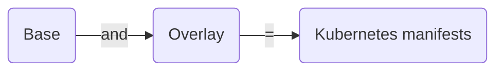

# Kustomize

Kustomize is an open-source configuration management tool for Kubernetes.

It allows you to define and manage Kubernetes objects such as deployments, Daemonsets, services, configMaps, etc for multiple environments in a declarative manner without modifying the original YAML files. To put it simply, you have a single source of truth for YAMLs, and you patch required configurations on top of the base YAMLs as per the environment requirements.

Here is what the official documentation says

> kustomize lets you customize raw, template-free YAML files for multiple purposes, leaving the original YAML untouched and usable as is.

Kustomize has two key concepts, Base and Overlays. With Kustomize we can reuse the base files (common YAMLs) across all environments and overlay (patches) specifications for each of those environments.

Overlaying is the process of creating a customized version of the manifest file **(base manifest + overlay manifest = customized manifest file).**

All customization specifications are contained within a `kustomization.yaml` file.

## Features

The following are the key features of Kustomize

1. Acts as a configuration tool with declarative configuration same as Kubernetes YAMLs.
2. It can modify resources without altering the original files.
3. It can add common labels and annotations to all the resources.
4. It can Modify container images based on the environment it is being deployed in.
5. Kustomize also ships with secretGenerator and configMapGenerator that use environment files or key-value pairs to create secrets and configMaps.

## Install

### Prerequisite

- You must have a Kubernetes cluster up and running and kubectl installed in our local machine and connected to the cluster.

The kustomize module is built into `kubectl`. You can use customize directly via `kubectl`. You can verify it using the following command.

```bash
kubectl kustomize --help
```

### Standalone Kustomize

The below-mentioned script automatically detects the OS and installs the Kustomize.

```bash
curl -s "https://raw.githubusercontent.com/kubernetes-sigs/kustomize/master/hack/install_kustomize.sh"  | bash
sudo mv kustomize /usr/local/bin
```

After installation, verify it by running the below command. It will show you the latest appropriate version of Kustomize. If it's not showing the version then close your terminal and run the command by opening a fresh terminal.

```bash
kustomize version
```

If you are still getting `bash: kustomize: command not found error` then run the below command and check again. This will set the path.

```bash
sudo install -o root -g root -m 0755 kustomize /usr/local/bin/kus
```

## Understanding Kustomize concepts

### 1. `kustomization.yaml`

This is a main file used by `kustomize`. This file contains a list of all the customizations that should be managed by Kustomize. It also contains all the customizations that we want to apply to generate the customized manifest.

### 2. `Base and Overlays`

The `base` folder represents the config that going to be identical across all the environments. We put all the Kubernetes manifests in the Base. It has a default value that we can overwrite.

On the other side, the `overlays` folder allows us to customize the behavior on a **per-environment** basis. We can create an Overlay for each one of the environments.

We specify all the properties and parameters that we want to overwrite and change.



Basically, Kustomize uses patch directive to introduce environment-specific changes on _existing Base standard k8s config files_ without disturbing them.

### 3. `Transformers`

As the name indicates, transformers are something that transforms one config into another. Using Transformers, we can transform our base Kubernetes YAML configs. Kustomize has several built-in transformers.

#### Common transformers

1. `commonLabel` - It adds a label to all Kubernetes resources
2. `namePrefix` - It adds a common prefix to all resource names
3. `nameSuffix` - It adds a common suffix to all resource names
4. `Namespace` - It adds a common namespace to all resources
5. `commonAnnotations` - It adds an annotation to all resources

#### Example `commonLabel` Transformer

In the below manifest, we have used `commonLabels` in `kustomization.yaml` where label `env: dev` gets added to the customized `deployment.yaml`.

- `deployment.yaml` (base)

    ```yaml
    apiVersion: apps/v1
    kind: Deployment
    metadata:
        name: web-deployment
    spec:
        selector:
            matchLabels:
                app: web
        replicas: 2
        template:
            metadata:
                labels:
                    app: web
            spec:
                containers:
                    - name: web
                    image: nginx:1.14.2
                    ports:
                        - containerPort: 80
    ```

- `kustomization.yaml` (overlay)

    ```yaml
    commonLebels:
        env: dev
    ```

- `deployment.yaml` (customized)

    ```diff
    apiVersion: apps/v1
    kind: Deployment
    metadata:
        name: web-deployment
    spec:
        selector:
            matchLabels:
                app: web
    +           env: dev
        replicas: 2
        template:
            metadata:
                labels:
                    app: web
    +               env: dev
            spec:
                containers:
                    - name: web
                      image: nginx:1.14.2
                      ports:
                        - containerPort: 80
    ```

#### Example Image Transformer

It allows us to modify an image that a specific deployment is going to use.

In the following example, the image transformer checks the `nginx` image name as mentioned `deployment.yaml` and changes it to the new name which is `ubuntu` in the `kustomization.yaml` file. We can change the tags as well.

- `deployment.yaml` (base)

    ```yaml
    apiVersion: apps/v1
    kind: Deployment
    metadata:
        name: web-deployment
    spec:
        selector:
            matchLabels:
                app: web
        replicas: 2
        template:
            metadata:
                labels:
                    app: web
            spec:
                containers:
                    - name: web
                    image: nginx:1.14.2
                    ports:
                        - containerPort: 80
    ```

- `kustomization.yaml` (overlay)

    ```yaml
    images:
        - name: nginx
          newName: ubuntu
          newTag: 23.04
    ```

- `deployment.yaml` (customized)

    ```diff
    apiVersion: apps/v1
    kind: Deployment
    metadata:
        name: web-deployment
    spec:
        selector:
            matchLabels:
                app: web
        replicas: 2
        template:
            metadata:
                labels:
                    app: web
            spec:
                containers:
                    - name: web
    -                 image: nginx:1.14.2
    +                 image: ubuntu:23.04
                      ports:
                        - containerPort: 80
    ```

### 4. `Patches` (Overlays)

Patches or overlays provide another method to modify Kubernetes configs. It provides more specific sections to change in the configuration. There are 3 parameters we need to provide:

1. `Operation Type`: `add` or `remove` or `replace`
2. `Target`: Resource name which we want to modify
3. `Value`: Value name that will either be added or replaced. For the `remove` operation type, there would not be any value.

#### There are two ways to define the patch

1. **`JSON 6902`**

    In this way, there are two details that we have to provide, the `target` and the `patch` details i.e. `operation`, `path`, and the new `value`.

    - `deployment.yaml` (base)

        ```yaml
        apiVersion: apps/v1
        kind: Deployment
        metadata:
            name: web-deployment
        spec:
            selector:
                matchLabels:
                    app: web
            replicas: 2
            template:
                metadata:
                    labels:
                        app: web
                spec:
                    containers:
                        - name: web
                        image: nginx:1.14.2
                        ports:
                            - containerPort: 80
        ```

    - `kustomization.yaml` (overlay)

        ```yaml
        patches:
            - target:
                kind: Deployment
                name: web-deployment
              patch: |-
                - op: replace
                  path: /metadata/name
                  value: app-deployment
        ```

    - `deployment.yaml` (customized)

        ```diff
        apiVersion: apps/v1
        kind: Deployment
        metadata:
        -   name: web-deployment
        +   name: app-deployment
        spec:
            selector:
                matchLabels:
                    app: web
            replicas: 2
            template:
                metadata:
                    labels:
                        app: web
                spec:
                    containers:
                        - name: web
                        image: nginx:1.14.2
                        ports:
                            - containerPort: 80
        ```

2. **`Stragetic Merge Patching`**

    In this way, all the patch details are similar to a standard k8s config. It would be the original manifest file, we just add the fields that need to be modified.

    - `deployment.yaml` (base)

        ```yaml
        apiVersion: apps/v1
        kind: Deployment
        metadata:
            name: web-deployment
        spec:
            selector:
                matchLabels:
                    app: web
            replicas: 2
            template:
                metadata:
                    labels:
                        app: web
                spec:
                    containers:
                        - name: web
                        image: nginx:1.14.2
                        ports:
                            - containerPort: 80
        ```

    - `kustomization.yaml` (overlay)

        ```yaml
        patches:
            patch: |-
                apiVersion: apps/v1
                kind: Deployment
                metadata:
                    name: web-deployment
                spec:
                    replicas: 5
        ```

    - `deployment.yaml` (customized)

        ```diff
        apiVersion: apps/v1
        kind: Deployment
        metadata:
            name: web-deployment
        spec:
            selector:
                matchLabels:
                    app: web
        -   replicas: 2
        +   replicas: 5
            template:
                metadata:
                    labels:
                        app: web
                spec:
                    containers:
                        - name: web
                        image: nginx:1.14.2
                        ports:
                            - containerPort: 80
        ```

#### Patch From File

For both types of patching, instead of inline configs, we can use the `separate file` method.

Specify all the patch details in a YAML file and refer it to the `kustomization.yaml` file under the patches directive.

For example, in `kustomization.yaml` you need to mention the patch file as follows. You need to specify the relative path of the YAML file.

```yaml
patches:
    - path: replicas.yaml
```

And we can put the changes in `replicas.yaml` as given below.

```yaml
apiVersion: apps/v1
kind: Deployment
metadata:
    name: web-deployment
spec:
    replicas: 5
```

## Helm vs. Kustomize

1. Helm provides more advanced features like hooks and release management, making it suitable for complex deployments. Kustomize is simpler and more straightforward.
2. Helm has complex templating, while Kustomize has no templating.
3. Kustomize doesn't need a separate setup. On the other hand, we need to set up Helm.
4. Helm has a large collection of pre-built `charts` that can be easily shared and reused, while Kustomize allows you to share configurations but lacks a centralized repository.
5. Kustomize has an easy learning curve, while Helm has difficulty as it introduces additional concepts like `charts` and `templates`.
6. Kustomize uses `overlays` and `patches` to modify existing configurations, while Helm uses `charts` to package and manage applications.
