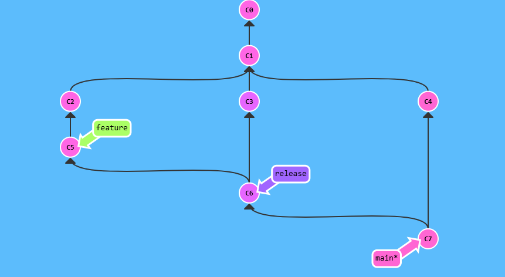

# Git brnaching



## Steps

```bash
git branch feature
git branch release
git checkout feature
git commit
git checkout release
git commit
git checkout main
git commit
git checkout release
git checkout feature
git commit
git checkout release
git merge feature
git checkout main
git merge release
```
